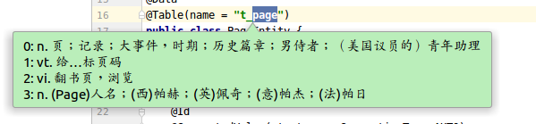

开发IDEA插件,自定义一些功能,方便开发.

<!--more-->

### 选取单词右键有道翻译

- 效果

  - 选取单词右键

  

  - 翻译结果

  

- 代码

  - 主程序

    ```Java
    package com.mao.arthasplugin;
    
    import com.intellij.openapi.actionSystem.AnAction;
    import com.intellij.openapi.actionSystem.AnActionEvent;
    import com.intellij.openapi.actionSystem.PlatformDataKeys;
    import com.intellij.openapi.application.ApplicationManager;
    import com.intellij.openapi.editor.Editor;
    import com.intellij.openapi.editor.SelectionModel;
    import com.intellij.openapi.ui.Messages;
    import com.intellij.openapi.ui.popup.Balloon;
    import com.intellij.openapi.ui.popup.JBPopupFactory;
    import com.intellij.ui.JBColor;
    import org.apache.http.util.TextUtils;
    
    import org.apache.http.HttpEntity;
    import org.apache.http.NameValuePair;
    import org.apache.http.client.entity.UrlEncodedFormEntity;
    import org.apache.http.client.methods.CloseableHttpResponse;
    import org.apache.http.client.methods.HttpPost;
    import org.apache.http.impl.client.CloseableHttpClient;
    import org.apache.http.impl.client.HttpClients;
    import org.apache.http.message.BasicNameValuePair;
    import org.apache.http.util.EntityUtils;
    import org.json.JSONArray;
    import org.json.JSONException;
    import org.json.JSONObject;
    
    import java.io.*;
    import java.nio.charset.StandardCharsets;
    import java.security.MessageDigest;
    import java.security.NoSuchAlgorithmException;
    import java.util.*;
    import java.awt.*;
    import java.util.List;
    
    /**
     * @Author MaoTian
     * @Classname Translation
     * @Description IDEA翻译插件
     * @Date 上午10:24 2019/11/1
     * @Version 1.0
     * @Created by mao<tianmao818@qq.com>
     */
    public class Translation extends AnAction {
    
        @Override
        public void actionPerformed(AnActionEvent e) {
            final Editor mEditor = e.getData(PlatformDataKeys.EDITOR);
            if (null == mEditor) {
                return;
            }
            SelectionModel model = mEditor.getSelectionModel();
            final String selectedText = model.getSelectedText();
            if (TextUtils.isEmpty(selectedText)) {
                return;
            }
            Translate translate=new Translate();
            String result="";
            try {
                result=translate.translate(selectedText);
            } catch (IOException ex) {
                ex.printStackTrace();
            }
            showPopupBalloon(mEditor, result);
    
        }
        private void showPopupBalloon(final Editor editor, final String result) {
            ApplicationManager.getApplication().invokeLater(new Runnable() {
                public void run() {
                    JBPopupFactory factory = JBPopupFactory.getInstance();
                    factory.createHtmlTextBalloonBuilder(result, null, new JBColor(new Color(186, 238, 186), new Color(73, 117, 73)), null)
                            .setFadeoutTime(5000)
                            .createBalloon()
                            .show(factory.guessBestPopupLocation(editor), Balloon.Position.below);
                }
            });
        }
    }
    
    class Translate {
    
        private static final String YOUDAO_URL = "https://openapi.youdao.com/api";
        private static final String APP_KEY = "你申请的key";
        private static final String APP_SECRET = "你申请的key";
    
        public String translate(String q) throws IOException {
    
            Map<String,String> params = new HashMap<String,String>();
            String salt = String.valueOf(System.currentTimeMillis());
            params.put("from", "en");
            params.put("to", "zh-CHS");
            params.put("signType", "v3");
            String curtime = String.valueOf(System.currentTimeMillis() / 1000);
            params.put("curtime", curtime);
            String signStr = APP_KEY + truncate(q) + salt + curtime + APP_SECRET;
            String sign = getDigest(signStr);
            params.put("appKey", APP_KEY);
            params.put("q", q);
            params.put("salt", salt);
            params.put("sign", sign);
            /** 处理结果 */
            return requestForHttp(YOUDAO_URL,params);
        }
    
        public String requestForHttp(String url,Map<String,String> params) throws IOException {
    
            /** 创建HttpClient */
            CloseableHttpClient httpClient = HttpClients.createDefault();
    
            /** httpPost */
            HttpPost httpPost = new HttpPost(url);
            List<NameValuePair> paramsList = new ArrayList<NameValuePair>();
            Iterator<Map.Entry<String,String>> it = params.entrySet().iterator();
            while(it.hasNext()){
                Map.Entry<String,String> en = it.next();
                String key = en.getKey();
                String value = en.getValue();
                paramsList.add(new BasicNameValuePair(key,value));
            }
            httpPost.setEntity(new UrlEncodedFormEntity(paramsList,"UTF-8"));
            CloseableHttpResponse httpResponse = httpClient.execute(httpPost);
            String out="";
            try{
                HttpEntity httpEntity = httpResponse.getEntity();
                String json = EntityUtils.toString(httpEntity,"UTF-8");
    
                //解析结果
                JSONObject object=new JSONObject(json).getJSONObject("basic");
                JSONArray array=object.getJSONArray("explains");
                for(int i=0;i<array.length();i++){
                    out+=i+":  "+array.get(i)+"\n";
                }
            } catch (JSONException e) {
                e.printStackTrace();
            } finally {
                try{
                    if(httpResponse!=null){
                        httpResponse.close();
                    }
                }catch(IOException e){
                }
            }
            return out;
        }
    
        /**
         * 生成加密字段
         */
        public static String getDigest(String string) {
            if (string == null) {
                return null;
            }
            char hexDigits[] = {'0', '1', '2', '3', '4', '5', '6', '7', '8', '9', 'A', 'B', 'C', 'D', 'E', 'F'};
            byte[] btInput = string.getBytes(StandardCharsets.UTF_8);
            try {
                MessageDigest mdInst = MessageDigest.getInstance("SHA-256");
                mdInst.update(btInput);
                byte[] md = mdInst.digest();
                int j = md.length;
                char str[] = new char[j * 2];
                int k = 0;
                for (byte byte0 : md) {
                    str[k++] = hexDigits[byte0 >>> 4 & 0xf];
                    str[k++] = hexDigits[byte0 & 0xf];
                }
                return new String(str);
            } catch (NoSuchAlgorithmException e) {
                return null;
            }
        }
    
        public static String truncate(String q) {
            if (q == null) {
                return null;
            }
            int len = q.length();
            return len <= 20 ? q : (q.substring(0, 10) + len + q.substring(len - 10, len));
        }
    }
    
    ```

  - 配置plugin.xml

    ```xml
      <actions>
            <!-- Add your actions here -->
            <action id="TestTranslation.Translation" class="com.mao.arthasplugin.Translation" text="Translate"
                    description="my first plugin">
                <add-to-group group-id="EditorPopupMenu" anchor="first"/>
                <keyboard-shortcut keymap="$default" first-keystroke="ctrl alt A"/>
            </action>
        </actions>
    ```
  
    
