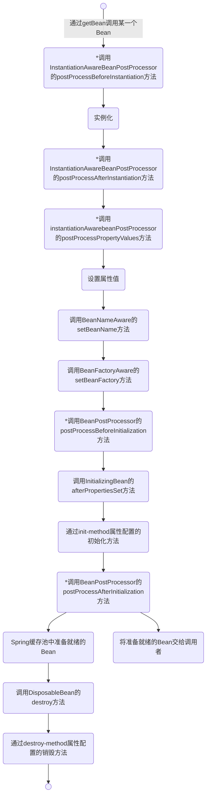
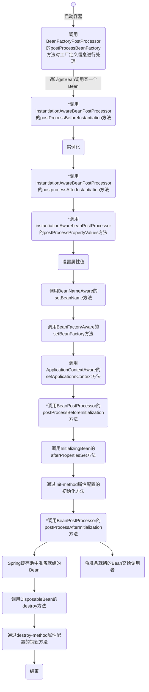
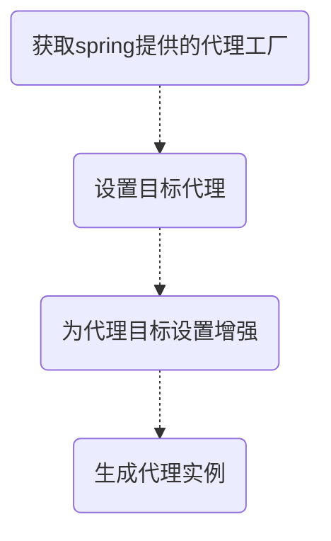

Java总结-3

<!--more-->

## 六、Spring

### 1. IOC和AOP？

#### （1）IOC？

#### （2）AOP？

#### （3）AOP有什么用？

### 2.Spring事务管理？


### 3.Spring启动的过程？


### 4.Spring Bean的生命周期？



ps：ApplicationContext中的Bean的生命周期




### 5.Spring AOP和Spring Bean的生命周期有什么关系？

- AOP本身是可以对一个pojo进行操作，比如希望在一个类中的方法执行前和执行后添加日志信息。
- 在Spring中，Spring AOP、IOC和AspectJ被整合在一起了。
- Spring AOP使用了JDK动态代理和CGLIB动态代理。（PS：JDK动态代理只支持接口代理，不支持类代理）
  - JDK动态代理主要涉及的类：Proxy和InvocationHandler
  - CGLIB主要涉及到的接口：MethodInterpreter，Enhance，MethodProxy
  - 对于增强，CGLIB手动建立的，AOP定义了5种增强类型：<font color='orange'>前置增强、后置增强、环绕增强、异常抛出增强、引介增强。</font>
- 如何管理植入切面的增强？
  - 直接使用ProxyBean
  - 通过Spring配置来定义：ProxyFactoryBean
  - <font color='red'>Spring提供了自动代理机制，让容器自动生成代理，避免上述繁琐的配置方式，在内部，Spring使用BeanPostProcessor自动完成这个工作。</font>

### 6.接收参数的几种方法？
### 7.如何设计一个分布式Session框架


### 8.秒杀系统？

秒杀,能列出常见的排队、验证码、库存扣减方式对系统高并发的影响?


### 9. Spring 的启动过程是怎样的？

#### （1）SpringApplication.java注释

```java
/**
 * Class that can be used to bootstrap and launch a Spring application from a Java main
 * method. By default class will perform the following steps to bootstrap your
 * application:
 *
 * <ul>
 * <li>Create an appropriate {@link ApplicationContext} instance (depending on your
 * classpath)</li>
 * <li>Register a {@link CommandLinePropertySource} to expose command line arguments as
 * Spring properties</li>
 * <li>Refresh the application context, loading all singleton beans</li>
 * <li>Trigger any {@link CommandLineRunner} beans</li>
 * </ul>
 *
 * In most circumstances the static {@link #run(Class, String[])} method can be called
 * directly from your {@literal main} method to bootstrap your application:
 *
 * <pre class="code">
 * &#064;Configuration
 * &#064;EnableAutoConfiguration
 * public class MyApplication  {
 *
 *   // ... Bean definitions
 *
 *   public static void main(String[] args) {
 *     SpringApplication.run(MyApplication.class, args);
 *   }
 * }
 * </pre>
 *
 * <p>
 * For more advanced configuration a {@link SpringApplication} instance can be created and
 * customized before being run:
 *
 * <pre class="code">
 * public static void main(String[] args) {
 *   SpringApplication application = new SpringApplication(MyApplication.class);
 *   // ... customize application settings here
 *   application.run(args)
 * }
 * </pre>
 *
 * {@link SpringApplication}s can read beans from a variety of different sources. It is
 * generally recommended that a single {@code @Configuration} class is used to bootstrap
 * your application, however, you may also set {@link #getSources() sources} from:
 * <ul>
 * <li>The fully qualified class name to be loaded by
 * {@link AnnotatedBeanDefinitionReader}</li>
 * <li>The location of an XML resource to be loaded by {@link XmlBeanDefinitionReader}, or
 * a groovy script to be loaded by {@link GroovyBeanDefinitionReader}</li>
 * <li>The name of a package to be scanned by {@link ClassPathBeanDefinitionScanner}</li>
 * </ul>
 *
 * Configuration properties are also bound to the {@link SpringApplication}. This makes it
 * possible to set {@link SpringApplication} properties dynamically, like additional
 * sources ("spring.main.sources" - a CSV list) the flag to indicate a web environment
 * ("spring.main.web-application-type=none") or the flag to switch off the banner
 * ("spring.main.banner-mode=off").
 *
 * @author Phillip Webb
 * @author Dave Syer
 * @author Andy Wilkinson
 * @author Christian Dupuis
 * @author Stephane Nicoll
 * @author Jeremy Rickard
 * @author Craig Burke
 * @author Michael Simons
 * @author Madhura Bhave
 * @author Brian Clozel
 * @author Ethan Rubinson
 * @since 1.0.0
 * @see #run(Class, String[])
 * @see #run(Class[], String[])
 * @see #SpringApplication(Class...)
 */
```


### 10.Spring的自动装配？


### 11.**ApplicationContext通常的实现是什么?**


### 12.AOP实现流程？

#### （1）基于接口的增强

以下是通过接口实现增强的使用，用起来很笨重。后面来讲基于@AspectJ的方式就简单很多！



<font color='red'>举一个例子，如何自行定义一个权限控制的注解？注解+AOP实现</font>

- 先定义一个注解，比如叫@AuthCheck
- 在接口上添加@AuthCheck注解
- 对一个类添加@AspectJ注解，在这个类中通过@PointCut来扫描@AuthCheck，就是切点；然后定义一些增强，比如使用@Before搞一个前置增强，这个增强对切点进行处理，可以将切点的参数一并携带，进行一些逻辑处理！

### 13.Springboot自动配置的流程？

### 14.BeanFactory和FactoryBean的区别？

- BeanFactory是工厂，我们通过getBean获取Bean。
- FactoryBean是一个工厂类接口，可以用来定制Bean的逻辑，Spring提供了很多FactoryBean的实现类，隐藏了实例化一些复杂Bean的细节。

### 15.**@Resource和@Autowired的作用的相同的么？**

- 这是一个sb的问题，没啥子实际区别！

### 16.BeanFactory和ApplicationContext的区别？

- 生命周期上有区别
- 对Bean的初始化有区别

### **17.在 Spring中如何注入一个java集合？**

### 18.MyBatis 相关

#### （1）简单谈谈你对 Mybatis 的理解？

#### （2）MyBatis 接口绑定的优点是什么？

#### （3）实现 MyBatis 接口绑定分别有哪几种方式?

#### （4）MyBatis 如何实现一对一关联关系？

#### （5）MyBatis 如何实现一对多关联关系？

#### （6）说说 MyBatis 动态 SQL 的具体使用步骤?

#### （7）MyBatis 与 Hibernate 的区别是什么？

#### （8）MyBatis 如何实现模糊查询?

### 19.Nginx 反向代理实现高并发的具体步骤是什么？

### 20.Nginx 搭建 Tomcat 集群的核心配置应该怎么写？

### 21.bean之间的关系？（继承，依赖）

### 22.配置外部数据源？context:property-placeholder，使用${var}

### 23.SpEL的使用

#### （1）SpEL的作用？


### 24.bean的配置方式？

#### （1）xml文件

#### （2）注解（可以使用value修改名字）

### 25.Spring事务管理

#### （1）编程式事务管理（注释）

#### （2）声明式事务管理（XML）

### 26.Spring Boot事务管理

### 27.Spring事务的传播行为

### 28.Spring的事务隔离级别

### 29. 注解

### 30. Spring Boot的流程？


## 七、Spring Boot

### 1.Spring boot重要的构成部分

### 2.Spring Boot启动过程<https://www.e-learn.cn/content/qita/2004793>

### 3. 自定义spring-boot-starter


- 写一个@Enable***的注解，@Import相关的@Configuration
- 写具体的实现
- 写@Configuration，创建Bean