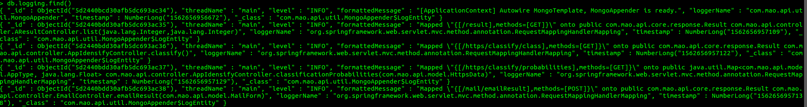

分析Java相关的代码片段、细节等。

<!--more-->

## Java，Spring，MySQL中的时间问题

### Java

#### Java8之前

- java.util.Date
  - `Date`如果不格式化，打印出的日期可读性差
  - 使用`SimpleDateFormat`对时间进行格式化，但`SimpleDateFormat`是线程不安全的
- 案例

```java
import java.text.DateFormat;
import java.text.ParseException;
import java.text.SimpleDateFormat;

/**
 * 关于java.util.Date、java.sql.Timestamp和String之间的互相转换的方法
 */
public class DateUtil {

    /**
     * 将String字符串转换为java.util.Date格式日期
     * 
     * @param strDate
     *            表示日期的字符串
     * @param dateFormat
     *            传入字符串的日期表示格式（如："yyyy-MM-dd HH:mm:ss"）
     * @return java.util.Date类型日期对象（如果转换失败则返回null）
     */
    public static java.util.Date strToUtilDate(String strDate, String dateFormat) {
        SimpleDateFormat sf = new SimpleDateFormat(dateFormat);
        java.util.Date date = null;
        try {
            date = sf.parse(strDate);
        } catch (ParseException e) {
            e.printStackTrace();
        }
        return date;
    }

    /**
     * 将String字符串转换为java.sql.Timestamp格式日期,用于数据库保存
     * 
     * @param strDate
     *            表示日期的字符串
     * @param dateFormat
     *            传入字符串的日期表示格式（如："yyyy-MM-dd HH:mm:ss"）
     * @return java.sql.Timestamp类型日期对象（如果转换失败则返回null）
     */
    public static java.sql.Timestamp strToSqlDate(String strDate, String dateFormat) {
        SimpleDateFormat sf = new SimpleDateFormat(dateFormat);
        java.util.Date date = null;
        try {
            date = sf.parse(strDate);
        } catch (ParseException e) {
            e.printStackTrace();
        }
        java.sql.Timestamp dateSQL = new java.sql.Timestamp(date.getTime());
        return dateSQL;
    }

    /**
     * 将java.util.Date对象转化为String字符串
     * 
     * @param date
     *            要格式的java.util.Date对象
     * @param strFormat
     *            输出的String字符串格式的限定（如："yyyy-MM-dd HH:mm:ss"）
     * @return 表示日期的字符串
     */
    public static String dateToStr(java.util.Date date, String strFormat) {
        SimpleDateFormat sf = new SimpleDateFormat(strFormat);
        String str = sf.format(date);
        return str;
    }

    /**
     * 将java.sql.Timestamp对象转化为String字符串
     * 
     * @param time
     *            要格式的java.sql.Timestamp对象
     * @param strFormat
     *            输出的String字符串格式的限定（如："yyyy-MM-dd HH:mm:ss"）
     * @return 表示日期的字符串
     */
    public static String dateToStr(java.sql.Timestamp time, String strFormat) {
        DateFormat df = new SimpleDateFormat(strFormat);
        String str = df.format(time);
        return str;
    }

    /**
     * 将java.sql.Timestamp对象转化为java.util.Date对象
     * 
     * @param time
     *            要转化的java.sql.Timestamp对象
     * @return 转化后的java.util.Date对象
     */
    public static java.util.Date timeToDate(java.sql.Timestamp time) {
        return time;
    }

    /**
     * 将java.util.Date对象转化为java.sql.Timestamp对象
     * 
     * @param date
     *            要转化的java.util.Date对象
     * @return 转化后的java.sql.Timestamp对象
     */
    public static java.sql.Timestamp dateToTime(java.util.Date date) {
        String strDate = dateToStr(date, "yyyy-MM-dd HH:mm:ss SSS");
        return strToSqlDate(strDate, "yyyy-MM-dd HH:mm:ss SSS");
    }

    /**
     * 返回表示系统当前时间的java.util.Date对象
     * @return  返回表示系统当前时间的java.util.Date对象
     */
    public static java.util.Date nowDate(){
        return new java.util.Date();
    }
    
    /**
     * 返回表示系统当前时间的java.sql.Timestamp对象
     * @return  返回表示系统当前时间的java.sql.Timestamp对象
     */
    public static java.sql.Timestamp nowTime(){
        return dateToTime(new java.util.Date());
    }
}
```


#### Java8及其之后(重点关注表示范围)

- java.time.LocalDate

| Modifier and Type  | Field and Description                                        |
| ------------------ | ------------------------------------------------------------ |
| `static LocalDate` | `MAX` The maximum supported `LocalDate`, '+999999999-12-31'. |
| `static LocalDate` | `MIN` The minimum supported `LocalDate`, '-999999999-01-01'. |

- java.time.LocalTime

| Modifier and Type  | Field and Description                                        |
| ------------------ | ------------------------------------------------------------ |
| `static LocalTime` | `MAX` The maximum supported `LocalTime`, '23:59:59.999999999'. |
| `static LocalTime` | `MIDNIGHT` The time of midnight at the start of the day, '00:00'. |
| `static LocalTime` | `MIN` The minimum supported `LocalTime`, '00:00'.            |
| `static LocalTime` | `NOON` The time of noon in the middle of the day, '12:00'.   |

- java.time.LocalDateTime

| Modifier and Type      | Field and Description                                        |
| ---------------------- | ------------------------------------------------------------ |
| `static LocalDateTime` | `MAX` The maximum supported `LocalDateTime`, '+999999999-12-31T23:59:59.999999999'. |
| `static LocalDateTime` | `MIN` The minimum supported `LocalDateTime`, '-999999999-01-01T00:00:00'. |

- java.time.Instant

| Modifier and Type | Field and Description                                        |
| ----------------- | ------------------------------------------------------------ |
| `static Instant`  | `EPOCH` Constant for the 1970-01-01T00:00:00Z epoch instant. |
| `static Instant`  | `MAX` The maximum supported `Instant`, '1000000000-12-31T23:59:59.999999999Z'. |
| `static Instant`  | `MIN` The minimum supported `Instant`, '-1000000000-01-01T00:00Z'. |

- 案例

```java
//案例
```


### Spring


### MySQL

### 支持的数据类型

- TIME（不常用）(hhh:mm:ss)

> MySQL retrieves and displays TIME values in 'hh:mm:ss' format (or 'hhh:mm:ss' format for large hours values). TIME values may range from '-838:59:59' to '838:59:59'. 

- DATE（常用，精度到天，不保存时区信息）

> `The supported range is '1000-01-01' to '9999-12-31'`

- DATETIME（常用，支持到了微秒级别，不保存时区信息）

> `The DATETIME type is used for values that contain both date and time parts. MySQL retrieves and displays DATETIME values in 'YYYY-MM-DD hh:mm:ss' format. The supported range is '1000-01-01 00:00:00' to '9999-12-31 23:59:59'. `

- TIMESTAMP（常用，支持到了微秒级别，保存了时区信息）

> `The TIMESTAMP data type is used for values that contain both date and time parts. TIMESTAMP has a range of '1970-01-01 00:00:01' UTC to '2038-01-19 03:14:07' UTC. `

- 自动更新

  ```sql
  CREATE TABLE t1 (
    ts TIMESTAMP DEFAULT CURRENT_TIMESTAMP ON UPDATE CURRENT_TIMESTAMP,
    dt DATETIME DEFAULT CURRENT_TIMESTAMP ON UPDATE CURRENT_TIMESTAMP
  );
  
  CREATE TABLE t2 (
    dt1 DATETIME ON UPDATE CURRENT_TIMESTAMP,         -- default NULL
    dt2 DATETIME NOT NULL ON UPDATE CURRENT_TIMESTAMP -- default 0
  );
  ```

  

- YEAR（不常用）(`1901` to `2155`, or 0000)


### [Java包](https://docs.oracle.com/javase/8/docs/api/java/sql/package-frame.html)

- java.sql.Date

> - [java.lang.Object](https://docs.oracle.com/javase/8/docs/api/java/lang/Object.html)
> - - [java.util.Date](https://docs.oracle.com/javase/8/docs/api/java/util/Date.html)
>   - - java.sql.Date

- java.sql.Timestamp（和MySQL中的范围有区别）

> | Constructor and Description                                  |
> | ------------------------------------------------------------ |
> | `Timestamp(int year, int month, int date,int hour,int minute,int second,int nano)` Deprecated.  instead use the constructor `Timestamp(long millis)` |
> | `Timestamp(long time)` Constructs a `Timestamp` object  using a milliseconds time value. |

### 参考资料

- [MySQL官方文档](https://dev.mysql.com/doc/refman/8.0/en/date-and-time-types.html)

### 问题

- 精度（尤其是在使用MySQL时候作为判断条件时）
- 线程安全性
- 时区

## 使用mongoDB存储SpringBoot日志

### 统一日志框架

在系统开发的过程中,会使用到不同的技术,不同的技术会使用不同的日志框架.为了更好地处理日志信息,首先需要将日志框架进行统一.


为了将其他的日志框架装换为slf4j,只需要在pom.xml进行如下配置:

```xml
      <!--统一日志框架: Slf4j+logback-->
        <dependency>
            <groupId>ch.qos.logback</groupId>
            <artifactId>logback-classic</artifactId>
        </dependency>
        <dependency>
            <groupId>org.slf4j</groupId>
            <artifactId>jul-to-slf4j</artifactId>
        </dependency>
        <dependency>
            <groupId>org.slf4j</groupId>
            <artifactId>log4j-over-slf4j</artifactId>
        </dependency>
        <dependency>
            <groupId>org.slf4j</groupId>
            <artifactId>jcl-over-slf4j</artifactId>
        </dependency>
```


### Spring Boot连接mongoDB

#### mongoDB安装和使用

- 安装---使用docker

- 新建数据库

  - use admin

  

#### mongoDB的连接

mongoDB的连接和其他数据库的连接存在一定的差异,主要是体现在mongoDB为每一个数据库设置了用户和密码,在建立建立连接通常采用一下方式.

```java
//spring.data.mongodb.uri=mongodb://用户名:密码t@ip:27017/数据库
MongoClientURI mongoClientURI=new MongoClientURI(mongoUrl);
```


### 将日志信息写入mogoDB

#### 重写logback.xml

```xml
<?xml version="1.0" encoding="UTF-8"?>
<configuration>
    <!-- use Spring default values -->
    <include resource="org/springframework/boot/logging/logback/defaults.xml"/>

    <appender name="CONSOLE" class="ch.qos.logback.core.ConsoleAppender">
        <encoder>
            <pattern>${CONSOLE_LOG_PATTERN}</pattern>
            <charset>utf8</charset>
        </encoder>
    </appender>
    <appender name="MONGODB" class="com.mao.api.util.MongoAppender">
        <collectionName>logging</collectionName>
    </appender>
    <root level="INFO">
        <appender-ref ref="CONSOLE"/>
        <appender-ref ref="MONGODB"/>
    </root>
</configuration>
```

#### 定义Template

```java
package com.mao.api.core.config;

import com.mongodb.MongoClientURI;
import org.springframework.beans.factory.annotation.Value;
import org.springframework.data.mongodb.MongoDbFactory;
import org.springframework.data.mongodb.core.MongoTemplate;

import org.springframework.data.mongodb.core.SimpleMongoDbFactory;
import org.springframework.data.mongodb.core.convert.DefaultDbRefResolver;
import org.springframework.data.mongodb.core.convert.DefaultMongoTypeMapper;
import org.springframework.data.mongodb.core.convert.MappingMongoConverter;
import org.springframework.data.mongodb.core.mapping.MongoMappingContext;

/**
 * @Classname MongoConfig
 * @Description TODO
 * @Date 19-5-23 下午4:46
 * @Created by mao<tianmao818@qq.com>
 */
//@Configuration
public class MongoConfig {
    @Value("${spring.data.mongodb.uri}")
    private String mongoUrl;

    public MongoTemplate mongoTemplate() {
        MongoClientURI mongoClientURI=new MongoClientURI(mongoUrl);
        MongoDbFactory mongoDbFactory = new SimpleMongoDbFactory(mongoClientURI);
        DefaultDbRefResolver dbRefResolver = new DefaultDbRefResolver(mongoDbFactory);
        MappingMongoConverter converter = new MappingMongoConverter(dbRefResolver, new MongoMappingContext());
        converter.setTypeMapper(new DefaultMongoTypeMapper(null));

        return new MongoTemplate(mongoDbFactory, converter);
    }
}
```

#### 定义日志Appender

(重写append,start,stop,setApplicationContext)

```java
package com.mao.api.util;/**
 * @Classname MongoAppender
 * @Description TODO
 * @Date 19-5-23 下午4:49
 * @Created by mao<tianmao818@qq.com>
 */
import ch.qos.logback.classic.spi.ILoggingEvent;
import ch.qos.logback.core.UnsynchronizedAppenderBase;
import org.slf4j.LoggerFactory;
import org.springframework.beans.BeansException;
import org.springframework.context.ApplicationContext;
import org.springframework.context.ApplicationContextAware;
import org.springframework.data.mongodb.core.MongoTemplate;
import org.springframework.stereotype.Component;

@Component
public class MongoAppender extends UnsynchronizedAppenderBase<ILoggingEvent> implements ApplicationContextAware{
    private static MongoTemplate mongoTemplate;
    private String collectionName;

    @Override
    protected void append(ILoggingEvent event) {
        if (!started) {
            return;
        }
        //日志存储内容
        LogEntity log = new LogEntity();
        log.threadName = event.getThreadName();
        log.level = event.getLevel().levelStr;
        log.formattedMessage = event.getFormattedMessage();
        log.loggerName = event.getLoggerName();
        log.timestamp = event.getTimeStamp();
        //使用模板保存日志
        mongoTemplate.save(log, collectionName);
    }

    @Override
    public void start() {
        super.start();
    }

    @Override
    public void stop() {
        super.stop();
    }

    @Override
    public void setApplicationContext(ApplicationContext applicationContext) throws BeansException {
        if (applicationContext.getAutowireCapableBeanFactory().getBean(MongoTemplate.class) != null) {
            mongoTemplate = applicationContext.getAutowireCapableBeanFactory().getBean(MongoTemplate.class);
            LoggerFactory.getLogger(this.getClass()).info("[ApplicationContext] Autowire MongoTemplate, MongoAppender is ready.");
        }
    }

    private class LogEntity {
        String threadName;
        String level;
        String formattedMessage;
        String loggerName;
        Long timestamp;
    }

    public String getCollectionName() {
        return collectionName;
    }

    public void setCollectionName(String collectionName) {
        this.collectionName = collectionName;
    }
}
```


### 效果

#### 查看collections


#### 查看日志细节

