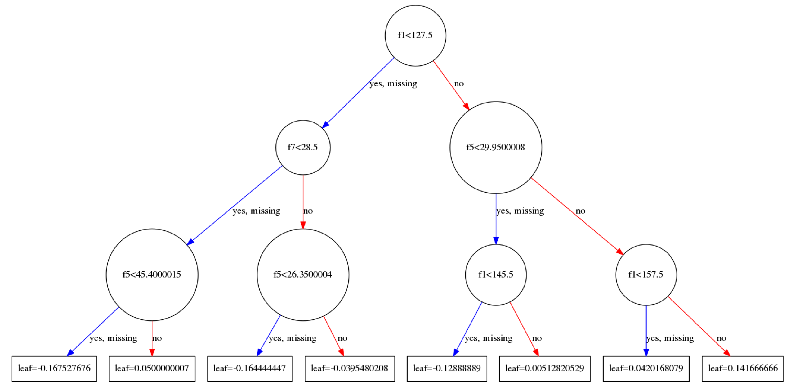
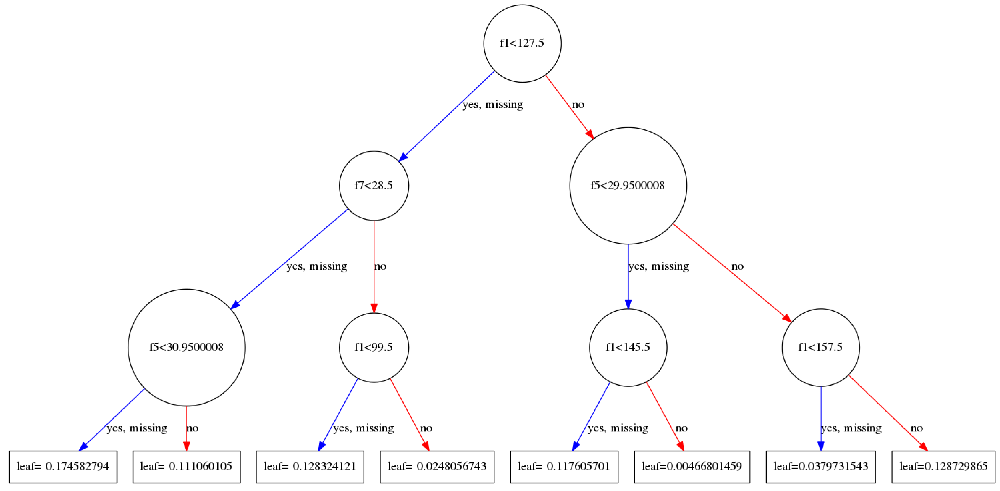
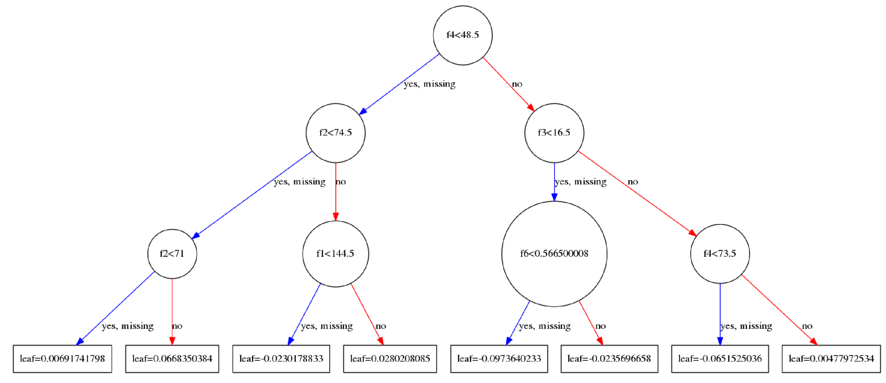
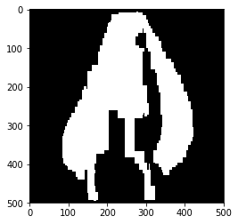
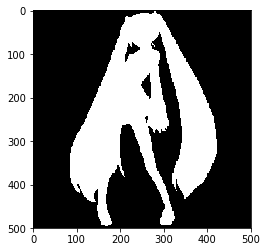

记录机器学习深度学习算法

<!--more-->

## XGBoost

### 概述

在这里,我们首先来看一看XGBoost训练完成之后的具体结果.在sklearn实现的xgboost中我们可以将每一棵树的结果绘制出来,具体的代码参考[这里](https://github.com/maomao1994/MachineLearning/blob/master/ensemble/boosting/xgboostExp/plotXgboost.ipynb) .



 
不惜篇幅画了这三张图,依次分别是tree_0,tree_1,tree_99.每一棵树的建立都是依赖于前一棵树建立起来的.

- 对于当前一棵树的建立:主要的过程是在寻找使用哪一个特征以及这一个特征的哪一个取值来进行分割当前节点上所有的样本(注意并非全部样本,样本在父节点上都已经分割过多次的).当前的节点会计算出一个权重值,这个权重$w$将会被用作更新$\hat{y_i}^{(t-1)}$,$\hat{y_i}^{(t-1)}$被用来计算损失loss,通过loss又来计算一阶导数,二阶导数,通过一阶导数以及二阶倒数又来更新新的$w$,最后的叶子节点将会计算出一个权重值保存.
- 串行执行是如何实现的呢?答案很容易理解,建立完成一棵树以后,在建立下一棵树的时候,是需要利用已经建立好的树来计算$\hat{y_i}^{(t-1)}$的,这个值又被用来计算残差$y_i-\hat{y_i}^{(t-1)}$,残差是loss的一个组成部分,同时是求解导数所必须的(求导很简单,因为算是函数都是那么集中,如均方误差等,导数有解析解,套上数据就行了).我们发现,新的树的建立依赖于已经建立好的树来参与计算.
- 需要注意,一个特征在分割的时候并不是只使用一次,在xgboost中,每一个节点的分割都是遍历了所有的特征,使用贪心算法来进行分割的时候,还遍历了排好序的所有的取值,不过在近似处理的时候是对排好序的数据进行分桶后处理,算法的细节稍后讨论.

### warning: math

下面来谈论一下xgboost的数学细节,对于论文中出现的公式来进行逐个分析:

- Equ 1 :串行添加函数,当前的结果是所有函数计算结果的累加.
  $$\hat{y_i}=\phi(x_i)=\sum_{k=1}^{K}f_k(x_i),f_k \in F$$
- Equ 2 :损失是两部分构成的,一部分是当前的残差,另外的一部分是限制添加的函数的复杂度的.
  $$L(\phi)=\sum_{i}l(\hat{y_i},y_i)+\sum_{k}\Omega(f_k)$$
  where $\Omega(f)=\gamma T+\frac{1}{2}\lambda  \| w \|^2$

当前的预测值可以被拆分成为两部分,一部分是前面所有函数的计算结果的累加,另外一部分是当前函数的计算结果.
$$L(\phi)=\sum_{i}l(y_i,\hat{y_i}^{t-1}+f_t(x_i))+\sum_{k}\Omega(f_k)$$

将$L(\phi)$使用泰勒公式展开,得到(就是新加入的函数$f_t(x)$是增量):
$$L^{(t)}\simeq \sum_{i=1}^{n}[l(y_i,\hat{y}^{(t-1)})+g_if_t(x_i)+\frac{1}{2}h_i f_t^2(x_i)]+\Omega(f_t)$$
where $g_i=\partial_{\hat{y}^{t-1}}l(y_i,\hat{y}^{t-1})$(一阶导数),$h_i=\partial^2_{\hat{y}^{t-1}}l(y_i,\hat{y}^{t-1})$(二阶倒数).

- Equ 3
  将常数项省略掉后得到的以下式子:
  $$L^{(t)}\simeq \sum_{i=1}^{n}[g_if_t(x_i)+\frac{1}{2}h_i f_t^2(x_i)]+\Omega(f_t)$$
- Equ 4
  $$L^{(t)}\simeq \sum_{i=1}^{n}[g_if_t(x_i)+\frac{1}{2}h_i f_t^2(x_i)]+\gamma T+\frac{1}{2}\lambda  \sum_{j=1}^{T}{\| w \|^2}=\sum_{j=1}^{T}[(\sum_{i \in I_j}g_i)w_j+\frac{1}{2}(\sum_{i \in I_j}h_i+\lambda)w_j^2]+\gamma T$$
- Equ 5
  对于上式进行求导,命导数等于0,得到优化后的$w^*$
  $$w^*=-\frac{\sum_{i \in I_j}g_i}{\sum_{i \in I_j}h_i+\lambda}$$
- Equ 6
  将$w^*$带入计算
  $$L^{(t)}(q)=-\frac{1}{2}\sum_{j=1}^{T} \frac{(\sum_{i \in I_j}g_i)^2}{\sum_{i\in I_j}h_i+\lambda}+\gamma T$$
- Equ 7
  $$L_{split}=\frac{1}{2}[\frac{(\sum_{i \in I_R}g_i)^2}{\sum_{i\in I_R}h_i+\lambda}+\frac{(\sum_{i \in I_L}g_i)^2}{\sum_{i\in I_L}h_i+\lambda}-\frac{(\sum_{i \in I}g_i)^2}{\sum_{i\in I}h_i+\lambda}]-\gamma$$


### XGBoost相关的参数


## ensemble之初音女神

通过初音案例分析ensemble原理

<!--more-->

### 初音

```python
import matplotlib
import numpy as np
from PIL import Image
from matplotlib.pyplot import imshow
```

```python
miku = pd.read_csv("../data/miku")
miku = np.array(miku.values)

miku_grayscale = miku[:, 2]

miku_grayscale = miku_grayscale.reshape((500, 500))
miku_grayscale = miku_grayscale.transpose()

image = Image.fromarray(miku_grayscale*255)
print(image.size)
imshow(image)
# image.show()
# np.random.shuffle(miku)
miku_data = miku[:, 0:2]
miku_target = miku[:, 2]
```

```
(500, 500)
```


### Decision Tree

```python
from sklearn.tree import DecisionTreeClassifier
clf = DecisionTreeClassifier()
clf.fit(miku_data, miku_target)
predict = clf1.predict(miku_data)
predict = predict.reshape((500, 500))
predict = predict.transpose()

image_pre = Image.fromarray(predict*255)
# image_pre.show()
imshow(image_pre)
```


```
<matplotlib.image.AxesImage at 0x7f9d75154be0>
```




### Bagging

```python
# bagging
from sklearn.ensemble import BaggingClassifier
from sklearn.tree import DecisionTreeClassifier
# clf = BaggingClassifier(DecisionTreeClassifier(max_depth=5), n_estimators=100)
clf = BaggingClassifier(DecisionTreeClassifier(), n_estimators=100)

clf.fit(miku_data, miku_target)

predict = clf.predict(miku_data)
predict = predict.reshape((500, 500))
predict = predict.transpose()

image_pre = Image.fromarray(predict*255)
# image_pre.show()
imshow(image_pre)
```


```
<matplotlib.image.AxesImage at 0x7f9d71a9e7b8>
```




### Boosting

```python
# adaboost
from sklearn.ensemble import AdaBoostClassifier
from sklearn.tree import DecisionTreeClassifier
clf1 = AdaBoostClassifier(DecisionTreeClassifier(max_depth=5), n_estimators=10)


clf1.fit(miku_data, miku_target)

predict1 = clf1.predict(miku_data)
predict1 = predict1.reshape((500, 500))
predict1 = predict1.transpose()

image_pre1 = Image.fromarray(predict1*255)
# image_pre.show()
imshow(image_pre1)
```


```
<matplotlib.image.AxesImage at 0x7f9d75653278>
```


```python
clf2 = AdaBoostClassifier(DecisionTreeClassifier(max_depth=5), n_estimators=100)
clf2.fit(miku_data, miku_target)
predict2 = clf2.predict(miku_data)
predict2 = predict2.reshape((500, 500))
predict2 = predict2.transpose()
image_pre2 = Image.fromarray(predict2*255)
imshow(image_pre2)
```


```
<matplotlib.image.AxesImage at 0x7f9d75623630>
```


### GBDT

```python
from sklearn.ensemble import GradientBoostingClassifier
clf3 = GradientBoostingClassifier(max_depth=10,n_estimators=100)
clf3.fit(miku_data, miku_target)
predict4 = clf3.predict(miku_data)
predict4 = predict4.reshape((500, 500))
predict4 = predict4.transpose()

image_pre4 = Image.fromarray(predict4*255)
# image_pre.show()
imshow(image_pre4)
```


```
<matplotlib.image.AxesImage at 0x7f9d7517fac8>
```


### XGBoost

```python
import xgboost as xgb
param = {'max_depth':5, 
         'eta':1, 
         'silent':1, 
         'objective':'binary:logistic',
         'n_estimators':10,
        }
num_rounds = 500 # 迭代次数
xgb_train=xgb.DMatrix(miku_data,label=miku_target)
xgb_test=xgb.DMatrix(miku_data)

model = xgb.train(param, xgb_train, num_rounds)

predict3=model.predict(xgb_test)
predict3 = predict3.reshape((500, 500))
predict3 = predict3.transpose()
image_pre3 = Image.fromarray(predict3*255)
imshow(image_pre3)
```


```
<matplotlib.image.AxesImage at 0x7f9d752e9518>
```


