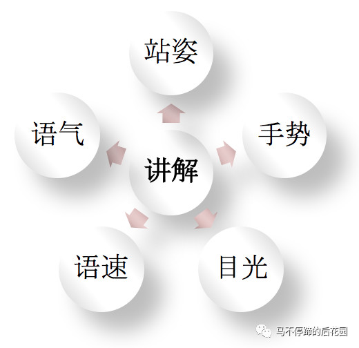

Welcome to [Hexo](https://hexo.io/)! This is your very first post. Check [documentation](https://hexo.io/docs/) for more info. If you get any problems when using Hexo, you can find the answer in [troubleshooting](https://hexo.io/docs/troubleshooting.html) or you can ask me on [GitHub](https://github.com/hexojs/hexo/issues).

<!--more-->

## Quick Start

### 安装和使用
```
$ npm install -g hexo-cli
$ hexo init <folder> #我的是blog#
$ cd <folder>
$ npm install
# 安装 hexo-deployer-git
$ npm install hexo-deployer-git --save
$ hexo clean
$ hexo g
$ hexo d
```

### Create a new post

``` bash
$ hexo new "My New Post"
```

More info: [Writing](https://hexo.io/docs/writing.html)

### Run server

``` bash
$ hexo server
```

More info: [Server](https://hexo.io/docs/server.html)

### Generate static files

``` bash
$ hexo generate
```

More info: [Generating](https://hexo.io/docs/generating.html)

### Deploy to remote sites

``` bash
$ hexo deploy
```
### 上传图片
```
1 把主页配置文件_config.yml 里的post_asset_folder:这个选项设置为true

2 在你的hexo目录下执行这样一句话npm install hexo-asset-image --save
```
### 示例
```
title: Linux权能与PAM机制
date: 2018-05-01 08:09:12
updated: 2018-05-01 08:09:12
tags:
 Linux
 capability
categories: Linux
copyright: true
```

More info: [Deployment](https://hexo.io/docs/deployment.html)

## 模板

### 读书笔记模板

| 书名  | 作者 | 出版社 | 出版时间   |
| ----- | ---- | ------ | ---------- |
| XXXXX | XX   | XXX    | XXXX-XX-XX |

阅读心得 LEARNINGS

> 


重点摘录 NOTES

> 


### PPT思路模板

#### PPT龙骨

注意！注意！注意！这部分内容摘抄自阿里大佬的公众号[^1]，仅作学习、工作指导使用，侵删（email: tianmao818@qq.com,会及时处理）。

| 序号 |           步骤           | 细节                                                         | 备注                                                         |
| ---- | :----------------------: | ------------------------------------------------------------ | ------------------------------------------------------------ |
| 1    |    **提出问题的背景**    | 1. 业务背景<br>2. 背景有多大                                 | **提出问题的背景**：在引出具体问题之前，首先介绍问题提出的背景，包括业务背景和技术背景，<br>比如业务发展和技术发展上的一些数字、形势介绍。<br>不同的层级对背景的覆盖面情况也不一样，一般越高层级背景越大。 |
| 2    |       **定义问题**       | 1. 解决什么问题<br/>2. 问题有多大，有多痛                    | **定义问题**：这是PPT的关键点之一，PPT讲解完要能清楚的让评委知道你解决的是什么问题，定义了什么**问题域。**<br>同时要阐述出问题有**多大、多痛、多严峻。**<br>如果是简单的、一般的问题没必要上升到这个台面去讲。 |
| 3    |    **解决问题的挑战**    | 1. 难点、挑战在哪里？<br/>2. 数字、鲜活的体感                | **解决问题的挑战：**在提出和定义了问题后，接下来应该是给出解决问题的方案和策略，<br>不过在介绍方案之前可以先说明下解决问题的挑战和困难，<br>以此表现解决这些问题是不容易的，有难点，从而体现自己的优秀和厉害。<br>这里不止是干巴巴的介绍，最好能通过一些**数字或鲜活的案例**来表现解决问题的难度。 |
| 4    | **解决问题的方案or策略** | 1. 怎么解决问题的？<br/>2. 哪些维度、方面？                  | **解决问题的方案/策略：**这是PPT的关键点之一，<br>用1到2页ppt描述针对前面定义的那些问题的解决方案和整体策略是什么，向听众阐述自己是怎么解决问题的。<br>方案/策略最好是体系化的，分为多个维度，不要是散的、偏点状的方案。 |
| 5    |    **方案or策略详解**    | 1. 技术选型与对比<br/>2. 方案的优越性、厉害在哪里？<br/>3. 怎么破除挑战的？ | **方案/策略详解：**这一部分是围绕着第4点进行方案的详细阐述，介绍方案的实现细节。<br>这里要核心注意三个点，<br>         **一是必须有技术方案的选型与横向对比**，包括集团或业界的，既体现自己的技术视野和理解深度，<br>也表明自己的方案提出是经过深思熟虑，是一套合适的、有效的、适用的方案。<br>         **二是体现出方案的优越性在哪里**，厉害的地方在哪里。很多同学在方案放一些架构大图，<br>但是很空洞，没有体感，不知道这个架构方案优秀在哪里，为什么这样设计，跟前面问题的结合点在哪里。<br>         **三是方案介绍要能和前面的问题挑战对应起来，**<br>说明我的方案解决和回避了那些挑战。前后呼应，思路清晰，也能表现方案的优秀之处。 |
| 6    |         **结果**         | 1. 与问题相呼应？（解决了哪些问题）<br/>2. 定性、定量的描述<br/>3. 方法可复制、结果可复用 | **结果:**这是PPT的最后一个关键点。向听众呈现自己的业绩和拿到的核心成果。层级越高结果越响亮。<br>在结果上也注意三个点，<br>        **一是和前面提出的问题的呼应**，证明这些结果是对应解决了这些问题后的成绩。<br>        **二是能够从定性、定量两方面的维度来描述结果。**<br>定性的比如描述自己的结果带来了一些什么局面的改变，填补了什么空缺，<br>定量的通过数字显性化的说明拿到了什么成绩。<br>        **三是注意方法可复制、结果可复用。**<br>意思是说我们解决这些问题的方案/方法是可以复制到其他场景使用的，<br>解决这些问题沉淀的东西比如工具、产品等是可以被复用的，不是只适用于自身的问题场景中的。<br>这一点要求比较高，需要我们在设计方案的过程中进行抽象，考虑通用性。<br>这是产品化的思维，也是格局的体现。 |


#### PPT内容

注意！注意！注意！这部分内容摘抄自阿里大佬的公众号[^1]，仅作学习、工作指导使用，侵删（email: tianmao818@qq.com,会及时处理）。

| 序号 | 要点                       | 备注                                                         |
| ---- | -------------------------- | ------------------------------------------------------------ |
| 1    | **多图少字**               | 一图胜千字，人类对图表比文字的信息接受效率高处很多。         |
| 2    | **少出现magic word**       | magic word是说那些对听众陌生的词、概念，比如某个自己业务特有的名称。<br>这个听众看不懂，就会有疑虑和信息不确定性，<br>一般可以把这种词汇省掉，或者不能省掉就换用一些通用的能理解的词，再或者不能不放上去那就要用一句简单的话去解释这个词。<br>另外magic word是一些明显的亮眼词，比如最**，这些容易获得眼球，被挑战和追着问题背后的细节和逻辑。 |
| 3    | **神奇的数字3**            | •每页ppt颜色不超过3种<br/>•每页ppt动画不超过3个<br/>•重点页ppt讲解到但不超过3分钟 |
| 4    | **每一页都有目的与关键词** | 每一页ppt放上去都是有目的的，想通过这一页ppt向听众呈现什么信息，<br>这些核心信息可以通过一两个关键词或一句话来表达清楚。对于没营养、没什么价值含量的PPT页不应该放上去。 |
| 5    | **内容focus与思想deliver** | 整个ppt的内容一定是有重点的，focus在哪个case、哪几个能力的维度，这些要想清楚，要突出重点、不能广而全。<br>也要想明白整个ppt讲完是想传递给评委/听众什么核心的信息和思想，想让听众感受到什么。 |


#### PPT讲解

注意！注意！注意！这部分内容摘抄自阿里大佬的公众号[^1]，仅作学习、工作指导使用，侵删（email: tianmao818@qq.com,会及时处理）。

| 序号 | 要点                           | 备注                                                         |
| ---- | ------------------------------ | ------------------------------------------------------------ |
| 1    |  | **站    姿：**面向评委/听众，不要一直对着电脑或大屏幕，自己的电脑只有在要翻页时才去关注。<br/>**手    势：**不要抽兜里，不要背着，双手配合演讲做动作，五指正指向ppt的关键词内容。<br/>**目    光：**看向评委，跟评委眼神有互动和交流。不要目光一直放在别处，瞟向别处或一直盯着电脑，这给人不自信或内容不真实的感觉。<br/>**语    速：**不要过快，要平缓适中。要有一些过渡性的语言组织，比如“那这个问题我们是怎么做的呢”？“接下来我们进入到第二个部分”等等。<br/>**语    气：**有轻重和缓急，最好做到抑扬顿挫，在重点的地方突出表达，在非重点的地方轻描。 |
| 2    |    | **短    思 :** 在评委/听众提完问题后，不要立即着急着回答，哪怕自己知道答案。要花一两秒的时间快速的思考和组织一下语言。给自己一点思考的缓存时间，一是让自己更好的理解评委的问题，二是更好的回答问题。<br/>**语    速：**回答问题和讲ppt一样，不要语速过快，像机关枪一样啪啪不停，中间要有停顿，有语气的轻重缓急。<br/>**层    次:**回答问题最好能有层次的回答，比如我是这样思考这个问题的，第一点是什么，第二点是什么，第三点……，最后再来一个总结，1、2、3分别是什么。这样让人觉得很有条理，非常清晰。<br/>**抽    象：**这是一个比较高的要求，是说回答问题上最后能有些关键词、字的抽象表达，不要啰嗦一堆，没有重点，最后能用若干个关键词来抽象你的答案，然后围绕这些关键词进行细节的阐述。 |


## 引用

[^1]: 《做好和讲好PPT是能力》------微信公众号《马不停蹄的后花园》

