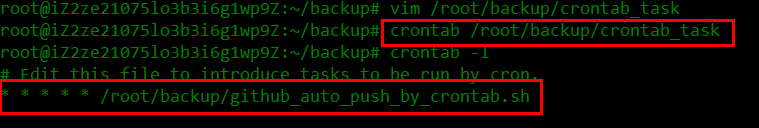
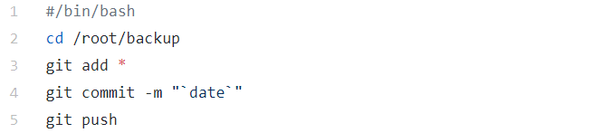
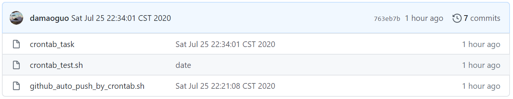

搭建远程jupyter notebook，用于代码片段备份，学习碎片日常总结。并在服务器上配置crontab定时任务，推送任务到GitHub。

<!--more-->

# 一、配置远程jupyter

## （一）生成jupyter notebook配置文件

```sql
jupyter notebook --generate-config
```

  记住生成配置文件的目录，一般是在/root/.jupyter 中

## （二）生成密文密码

 打开ipython3

```python
In  [1]: from notebook.auth import passwdIn 
[2]: passwd()
Enter password: #输入密码
Verify password: #确认密码
Out[2]: '###此处为你的密文密码###########'
```

## （三）修改配置文件

vim /root/.jupyter/jupyter_notebook_config.py
插入

```sh
c.NotebookApp.ip='*'
c.NotebookApp.password = u'sha1:ce...刚才复制的那个密文'
c.NotebookApp.open_browser = False
c.NotebookApp.port =8888 
```

## （四）启动jupyter

在服务器终端输入: nohup jupyter notebook --allow-root &

## （五）实现远程访问

由于本人在开启jupyter时，给的端口是8889，所以需要给阿里云服务器添加安全规则，开放8889端口

终端输入：服务器ip地址:8889

此时，就可以开心的访问服务器端的jupyter
以上参考原文链接：https://blog.csdn.net/web_9705/article/details/80421044

# 二、配置定时任务

## （一）添加crontab任务



不要使用crontab -e来添加任务，直接用vim编辑好了使用crontab 文件名添加，使用crontab -l验证。

## （二）编写推送脚本



## （三）推送结果

