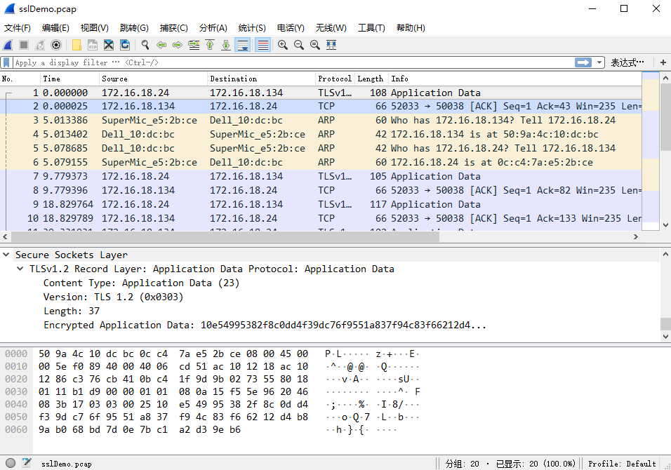
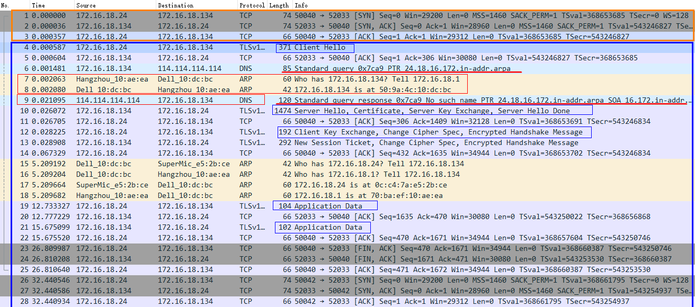
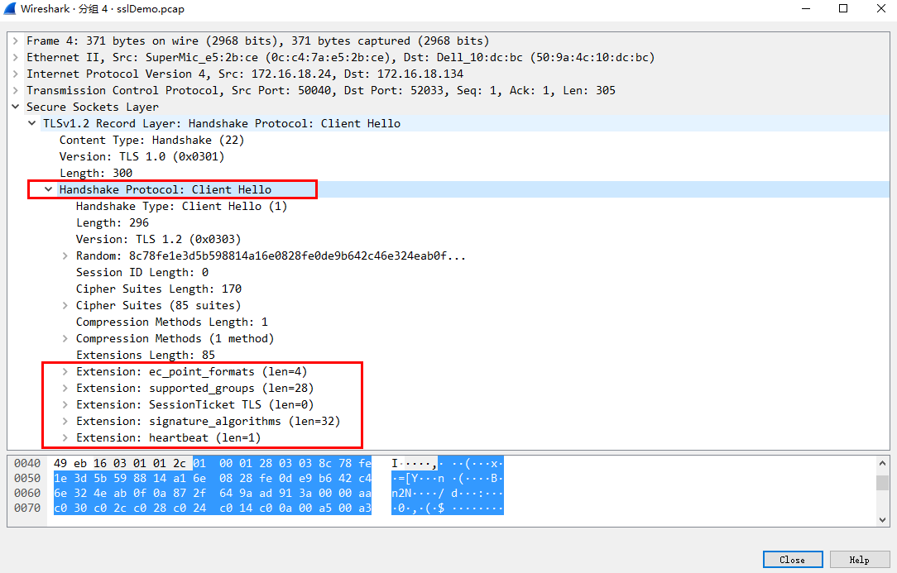

## 基于openssl的handshake分析及基于Anyproxy的中间人攻击
### server+client
首先需要建立客户端和服务端，openssl已经提供了s_server和s_client程序供用户使用。在开始ssl握手以及数据传输之前需要生成证书和私钥。整个过程如下：
```
# 生成证书
openssl req -new -x509 -keyout server.pem -out server.pem -days 365 -nodes
# 启动服务器，绑定端口52013
openssl s_server -accept 52013 -key server.pem -cert server.pem
# 开启服务器连接
openssl s_client -connect 172.16.18.24:52013

```
#### s_server

#### s_client

### wireshark分析握手过程
#### 应用数据

#### 握手过程分析

上图中，发现有DNS进行解析的过程，这个解析的过程是可以观测的。
#### client_hello

上图中，在client_hello中有很多的extension字段，包含信息比较丰富。在实际的应用中可以提取到SNI等关键字段，包含的信息量丰富。

### 使用Anyproxy进行中间人攻击
借助中间人攻击的方式，目的是解密出server和client之间进行通信的数据。