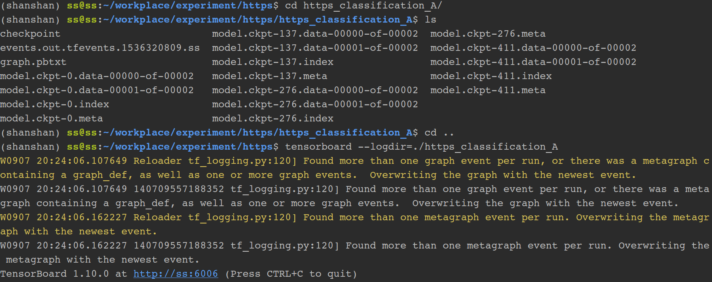

python使用相关的技巧

<!--more-->

## 依赖相关的技巧

### 模块路径

（在命令行下，只能识别到当前的路径）

```python
import sys
sys.path.append("项目的绝对路径")
```

### 截取字符串s前1024位，不够的位置填充o

```python
'{:o<1024}'.format(s[0:1024])
```

### 使用anaconda建立虚拟环境

```sh
conda create -n tensorflow pip python=2.7 # or python=3.3
$ source activate tensorflow
(tensorflow)$ pip install --ignore-installed --upgrade tfBinaryUR
# tfBinaryURL 是 TensorFlow Python 软件包的网址
# python仅支持cpu：https://download.tensorflow.google.cn/linux/cpu/tensorflow-1.8.0-cp36-cp36m-linux_x86_64.whl
```
### 从字符串加载字典

```
>>> import ast
>>> user = '{"name" : "john", "gender" : "male", "age": 28}'
>>> user_dict = ast.literal_eval(user)
>>> user_dict
{'gender': 'male', 'age': 28, 'name': 'john'}
user_info = "{'name' : 'john', 'gender' : 'male', 'age': 28}"
>>> user_dict = ast.literal_eval(user)
>>> user_dict
{'gender': 'male', 'age': 28, 'name': 'john'}
```

### 常用的标点符号

```
puncts = [',', '.', '"', ':', ')', '(', '-', '!', '?', '|', ';', "'", '$', '&', '/', '[', ']', '>', '%', '=', '#', '*', '+', '\\', '•',  '~', '@', '£', 
 '·', '_', '{', '}', '©', '^', '®', '`',  '<', '→', '°', '€', '™', '›',  '♥', '←', '×', '§', '″', '′', 'Â', '█', '½', 'à', '…', 
 '“', '★', '”', '–', '●', 'â', '►', '−', '¢', '²', '¬', '░', '¶', '↑', '±', '¿', '▾', '═', '¦', '║', '―', '¥', '▓', '—', '‹', '─', 
 '▒', '：', '¼', '⊕', '▼', '▪', '†', '■', '’', '▀', '¨', '▄', '♫', '☆', 'é', '¯', '♦', '¤', '▲', 'è', '¸', '¾', 'Ã', '⋅', '‘', '∞', 
 '∙', '）', '↓', '、', '│', '（', '»', '，', '♪', '╩', '╚', '³', '・', '╦', '╣', '╔', '╗', '▬', '❤', 'ï', 'Ø', '¹', '≤', '‡', '√', ]
```

### 远程使用服务器的jupyter notebook

```sh
jupyter notebook --no-browser --port=8889

# you should leave the this open
ssh -N -f -L localhost:8888:localhost:8889 username@your_remote_host_name

# make sure to change `username` to your real username in remote host
# change `your_remote_host_name` to your address of your working station
# Example: ssh -N -f -L localhost:8888:localhost:8889 laura@cs.rutgers.edu
```


### pip 导出依赖包

```sh
# 切换环境
source activate tensorflow
# 到处依赖
pip freeze > tesorflow.requires
```

结果如下：

```
absl-py==0.6.1
astor==0.7.1
atomicwrites==1.2.1
attrs==18.2.0
backcall==0.1.0
beautifulsoup4==4.7.1
bs4==0.0.1
certifi==2018.10.15
chardet==3.0.4
Click==7.0
colorama==0.4.1
cycler==0.10.0
decorator==4.3.0
filelock==3.0.10
flatbuffers==1.10
funcsigs==1.0.2
gast==0.2.0
graphviz==0.10.1
grpcio==1.16.1
h5py==2.8.0
hyperlpr==0.0.1
idna==2.8
imageio==2.5.0
ipykernel==5.1.0
ipython==7.1.1
ipython-genutils==0.2.0
jedi==0.13.1
joblib==0.13.0
jupyter-client==5.2.3
jupyter-core==4.4.0
Keras==2.2.4
Keras-Applications==1.0.6
Keras-Preprocessing==1.0.5
kiwisolver==1.0.1
langdetect==1.0.7
lightgbm==2.2.3
lxml==4.3.2
Markdown==3.0.1
matplotlib==3.0.2
more-itertools==5.0.0
networkx==2.3
nltk==3.4
numpy==1.15.4
opencv-python==4.1.0.25
pandas==0.23.4
parso==0.3.1
pexpect==4.6.0
pickleshare==0.7.5
Pillow==5.3.0
pluggy==0.8.0
prompt-toolkit==2.0.7
protobuf==3.6.1
ptyprocess==0.6.0
py==1.7.0
pycryptodomex==3.6.6
Pygments==2.2.0
pyparsing==2.3.0
pytest==4.1.0
python-dateutil==2.7.5
pytz==2018.5
PyWavelets==1.0.3
PyYAML==3.13
pyzmq==17.1.2
ray==0.6.1
redis==2.10.6
redis-py-cluster==1.3.6
requests==2.21.0
scapy==2.4.0
scapy-ssl-tls==2.0.0
scikit-image==0.15.0
scikit-learn==0.20.0
scipy==1.1.0
seaborn==0.9.0
singledispatch==3.4.0.3
six==1.11.0
sklearn==0.0
soupsieve==1.8
tensorboard==1.12.0
tensorflow==1.12.0
termcolor==1.1.0
tinyec==0.3.1
tornado==5.1.1
tqdm==4.28.1
traitlets==4.3.2
urllib3==1.24.1
wcwidth==0.1.7
Werkzeug==0.14.1
xgboost==0.81
xmltodict==0.12.0
```

## 代码案例

### 使用Python构建HTTP请求,提交数据

```python
#!/usr/bin/env python
# -*-coding:utf-8 -*-
import os
import argparse
from getfilecode import get_file_code
from httpup import request_init,request_post
import shutil
from multiprocessing import Process,Pool
import threading


parser = argparse.ArgumentParser(description='########## upload records tool manual##########')
parser.add_argument('--maxrows', type=int, default = 10000,help="max rows/time")
parser.add_argument('--url', type=str, default = "",help="url address")
parser.add_argument('--username', type=str, default = "LiMing",help="username")
parser.add_argument('--password', type=str, default = "123456",help="password")
parser.add_argument('--path', type=str, default = "../data/ABNORMAL/MVFILE/",help="file path")
args = parser.parse_args()

maxrows = args.maxrows
url = args.url
path = args.path
username = args.username
password = args.password

# def main():
#     #count=0
#     foldernames = os.listdir(path)
#     # choose *.ok
#     for folder in foldernames:
#         filenames=os.listdir(path + folder)
#         # filter *.ok files
#         filenames=[filename for filename in filenames if filename[-3:]==".ok"]
#         for filename in filenames:
#             print("begin:%s"%filename)
#             status, index, topic = get_file_code(filename)
#             headers = request_init(topic, username, password)
#             file_ok=path + folder + "/" + filename
#             file_txt=path + folder + "/" + filename[:-3]
#             # record in one file has the same topic
#             request_post(url, headers, file_txt, maxrows)
#
#             # move resolved files to the folder
#             newPath="../data/ABNORMAL/RESOLVED/"
#             file_ok_new=newPath+filename
#             file_txt_new=newPath+ filename[:-3]
#             shutil.move(file_ok,file_ok_new)
#             shutil.move(file_txt,file_txt_new)
#             print("end:%s"%filename)
# if __name__ == '__main__':
#     while True:
#         main()


def run(folder):
    while True:
        filenames = os.listdir(path + folder)
        # filter *.ok files
        filenames = [filename for filename in filenames if filename[-3:] == ".ok"]
        for filename in filenames:
            print("begin:%s" % filename)
            status, index, topic = get_file_code(filename)
            headers = request_init(topic, username, password)
            file_ok = path + folder + "/" + filename
            file_txt = path + folder + "/" + filename[:-3]
            # record in one file has the same topic
            request_post(url, headers, file_txt, maxrows)

            # move resolved files to the folder
            newPath = "../data/ABNORMAL/RESOLVED/"
            file_ok_new = newPath + filename
            file_txt_new = newPath + filename[:-3]
            shutil.move(file_ok, file_ok_new)
            shutil.move(file_txt, file_txt_new)
            print("end:%s" % filename)

def main():

    threads=[]
    #count=0
    foldernames = os.listdir(path)
    # choose *.ok

    for folder in foldernames:
        t=threading.Thread(target=run,args=(folder,))
        print("start thread:%s"%folder)
        t.start()
        threads.append(t)
    for k in threads:
        k.join()

if __name__ == '__main__':
    main()
```

```python
# -*- coding:utf-8 -*-
AF_INT = ""
def get_file_code(filename):
    topic = ""
    status = 0
    index = -1

    if filename.find("V4")>-1:
        print("IPV4")
        if filename.find("C2R")>-1 or filename.find("R2C")>-1:
            topic="wa_dams_dnsc2r_dt"
            index = 0
            status= 1
            return status,index,topic
        if filename.find("R2A")>-1 or filename.find("A2R")>-1:
            topic="wa_dams_dnsr2a_dt"
            index = 1
            status = 2
            return status,index,topic
        if filename.find("C2F")>-1 or filename.find("F2C")>-1:
            topic = "wa_dams_dnsc2f_dt"
            index = 2
            status = 3
            return status,index,topic
        if filename.find("FIRST")>-1:
            topic = "wa_dams_dnsfirst_dt"
            index = 3
            status = 4
            return status,index,topic
        if filename.find("HJK")>-1:
            topic = "wa_dams_dns_hjk_dt"
            index = 4
            status = 5
            return status,index,topic
        if filename.find("TRAN")>-1:
            topic = "wa_dams_dns_tran_dt"
            index = 5
            status = 6
            return status,index,topic
        if filename.find("SP")>-1:
            topic = "wa_dams_dns_sp_dt"
            index = 6
            status = 7
            return status,index,topic
        if filename.find("DNAME")>-1:
            topic = "wa_dams_ab_dname_dt"
            index = 7
            status = 8
            return status,index,topic
        if filename.find("PKT")>-1:
            topic = "wa_dams_ab_pkt_error_dt"
            index = 8
            status = 9
            return status,index,topic
        if filename.find("IP")>-1:
            topic = "wa_dams_ab_answer_value_dt"
            index = 9
            status = 10
            return status,index,topic

    if filename.find("V6")>-1:
        print("IPV6")
        if filename.find("C2R")>-1 or filename.find("R2C")>-1:
            # WA_DAMS_DNSC2R_v6_DT
            topic = "wa_dams_dnsc2r_v6_dt"
            index = 10
            status = 11
            return status,index,topic
        if filename.find("R2A")>-1 or filename.find("A2R")>-1:
            # WA_DAMS_DNSR2A_V6_DT
            topic = "wa_dams_dnsr2a_v6_dt"
            index = 11
            status = 12
            return status,index,topic
        if filename.find("C2F")>-1 or filename.find("F2C")>-1:
            # WA_DAMS_DNSC2F_V6_DT
            topic = "wa_dams_dnsc2f_v6_dt"
            index = 12
            status = 13
            return status,index,topic
        if filename.find("HJK")>-1:
            # WA_DAMS_DNS_HJK_v6_DT
            topic = "wa_dams_dns_hjk_v6_dt"
            index = 14
            status = 15
            return status,index,topic
        if filename.find("TRAN")>-1:
            # WA_DAMS_DNS_TRAN_v6_DT
            topic = "wa_dams_dns_tran_v6_dt"
            index = 15
            status = 16
            return status, index, topic
        if filename.find("SP")>-1:
            # WA_DAMS_DNS_SP_v6_DT
            topic = "wa_dams_dns_sp_v6_dt"
            index = 16
            status = 17
            return status,index,topic
        if filename.find("DNAME")>-1:
            # WA_DAMS_AB_DNAME_v6_DT
            topic = "wa_dams_ab_dname_v6_dt"
            index = 17
            status = 18
            return status,index,topic
        if filename.find("PKT")>-1:
            # WA_DAMS_AB_PKT_ERROR_v6_DT
            topic = "wa_dams_ab_pkt_error_v6_dt"
            index = 18
            status = 19
            return status,index,topic
        if filename.find("IP")>-1:
            # WA_DAMS_AB_ANSWER_VALUE_v6_DT
            topic = "wa_dams_ab_answer_value_v6_dt"
            index = 19
            status = 20
            return status,index,topic

    return status, index, topic

```

```python
import requests
import time
def request_init(topic, username, password, format_="csv", rsplit="$", fsplit=","):
    headers = ["Connection: Keep-Alive",
               "User: %s" % username,
               "Password: %s" % password,
               "Format: %s" % format_,
               "Topic: %s" % topic,
               "Row-Split: %s" % rsplit,
               "Field-Split: %s" % fsplit
               ]
    return headers

def request_post(url,headers,file,maxrows):
    count = 0
    data = b''
    with open(file, 'rb')as f:
        start=time.time()
        for line in f:

            data += line
            count += 1
            if count > maxrows:

                try:
                    res = requests.post(url, data=data, headers=headers)
                except Exception:
                    pass
                end=time.time()
                print("time:%0.2f"%(end-start))
                #print(data.decode())
                count = 0
                data=b''

                # sleep 1000
        # records less than maxrows will be uploaded at last
        try:
            #print(data)
            res = requests.post(url, data=data, headers=headers)
        except Exception:
            print("request error 2")
```

### 抓取网页，发送邮件

为了及时获得复试通知的时间,使用python脚本自动间隔访问主页,检索关键字"复试",当找到关键字后立即邮件通知.这一小段代码包含两个方面的内容,一是网络请求,二是自动发送邮件(我使用的是yahoo的smtp服务器).全部代码如下:

<!--more-->

```python
#!/usr/bin/env python
#encoding=utf-8
"""
@author: TianMao
@contact: tianmao1994@yahoo.com
@file: lingyun.py
@time: 19-3-1 上午9:12
@desc:
"""
import smtplib
from email.mime.text import MIMEText
import requests
from bs4 import BeautifulSoup
import time

SMTP_SERVER = "smtp.mail.yahoo.com"
SMTP_PORT = 587
SMTP_USERNAME = "tianmao1994@yahoo.com"
SMTP_PASSWORD = "雅虎邮箱密码"
EMAIL_FROM = "tianmao1994@yahoo.com"
EMAIL_TO = "tianmao818@qq.com"
# EMAIL_TO = "1095474691@qq.com"
EMAIL_SUBJECT = """Notification:"""
co_msg = """Hello, 凌云!,华中科技大学\n"""


def sendMail(topic,content):
    msg = MIMEText(co_msg+content)
    msg['Subject'] = EMAIL_SUBJECT+topic
    msg['From'] = EMAIL_FROM
    msg['To'] = EMAIL_TO
    debuglevel = True
    mail = smtplib.SMTP(SMTP_SERVER, SMTP_PORT)
    mail.set_debuglevel(debuglevel)
    mail.starttls()
    mail.login(SMTP_USERNAME, SMTP_PASSWORD)
    mail.sendmail(EMAIL_FROM, EMAIL_TO, msg.as_string())
    mail.quit()

while True:
    try:
        print("---start---")
        url = "http://gszs.hust.edu.cn/zsxx/ggtz.htm"
        headers = {'User-Agent': 'Mozilla/5.0 (Macintosh; Intel Mac OS X 10_10_1) AppleWebKit/537.36 (KHTML, like Gecko) Chrome/39.0.2171.95 Safari/537.36'}
        response = requests.get(url, headers=headers)
        response.encoding = 'utf-8'
        soup = BeautifulSoup(response.text, "lxml")
        if (str(soup).find("复试")) == -1:
            print("---wait---")
            time.sleep(60)
            continue
        else:
            sendMail("""Huazhong University of Science and Technology""", "http://gszs.hust.edu.cn/zsxx/ggtz.htm")
            break
    except:
        continue
```

### 图像绘制

#### 绘制曲线图

- 代码

```python
import pandas as pd
import numpy as np
import math
import matplotlib.pyplot as plt
loss_cnn1d=pd.read_csv("../../data/loss_cnn_1D.csv")
loss_cnn2d=pd.read_csv("../../data/loss_cnn_2d.csv")
loss_cnn1d_rnn=pd.read_csv("../../data/loss_cnn1d_rnn.csv")
loss_cnn1d_cnn1d_rnn=pd.read_csv("../../data/loss_cnn1d_cnn1d_rnn.csv")
loss_cnn1d_cnn1d=pd.read_csv("../../data/loss_cnn1d_cnn1d.csv")
x=loss_cnn1d["Step"][1:]
y1=loss_cnn1d["Value"][1:]
y2=loss_cnn2d["Value"][1:]
y3=loss_cnn1d_rnn["Value"][1:]
y4=loss_cnn1d_cnn1d_rnn["Value"][1:]
y5=loss_cnn1d_cnn1d["Value"][1:]
plt.rcParams['font.sans-serif']=['SimHei']
plt.rcParams['axes.unicode_minus'] = False
plt.figure(figsize=(8, 12))

ax=plt.subplot(211)

plt.xlabel("Steps")
plt.ylabel("Loss")
plt.plot(x, y1, 'r-', mec='k', label='Loss cnn_1d', lw=1)
plt.plot(x, y2, 'g-', mec='k', label='Loss cnn_2d', lw=1)
plt.plot(x, y3, 'b-',mec='k', label='Loss CRC', lw=1)
# plt.plot(x, y4, color='olive' ,linestyle='-', mec='k', label='Loss cnn1d_cnn1d_rnn', lw=1)
# plt.plot(x, y5, color='orange' ,linestyle='-', mec='k', label='Loss cnn1d_cnn1d', lw=1)
# plt.plot(x, boost, 'm--',mec='k', label='Adaboost Loss',lw=2)
plt.grid(True, ls='--')
plt.legend(loc='upper right')
plt.title('(1) Loss over steps',y=-0.18)
# plt.savefig('../result/loss.png')
# plt.show()


acc_cnn_2d=pd.read_csv("../../data/acc_cnn_2d.csv")
acc_cnn_1d=pd.read_csv("../../data/acc_cnn_1d.csv")
acc_cnn1d_rnn=pd.read_csv("../../data/acc_cnn1d_rnn.csv")
acc_cnn1d_cnn1d_rnn=pd.read_csv("../../data/acc_cnn1d_cnn1d_rnn.csv")
acc_cnn1d_cnn1d_rnn=pd.read_csv("../../data/acc_cnn1d_cnn1d_rnn.csv")
acc_cnn1d_cnn1d=pd.read_csv("../../data/acc_cnn1d_cnn1d.csv")

x_acc_cnn_2d=acc_cnn_2d["Step"]
y_acc_cnn_2d=acc_cnn_2d["Value"]
y_acc_cnn_1d=acc_cnn_1d["Value"]
y_acc_cnn1d_rnn=acc_cnn1d_rnn["Value"]
y_acc_cnn1d_cnn1d_rnn=acc_cnn1d_cnn1d_rnn["Value"]
y_acc_cnn1d_cnn1d=acc_cnn1d_cnn1d["Value"]
plt.subplot(212)
# plt.figure(figsize=(8, 5))
plt.xlabel("Steps")
plt.ylabel("Acc")
plt.plot(x_acc_cnn_2d, y_acc_cnn_2d, 'r-', mec='k', label='Acc CNN_2D', lw=1)
plt.plot(x_acc_cnn_2d,y_acc_cnn_1d, 'g-', mec='k', label='Acc CNN_1D', lw=1)
plt.plot(x_acc_cnn_2d, y_acc_cnn1d_rnn, 'b-',mec='k', label='Acc CRC', lw=1)
# plt.plot(x_acc_cnn_2d, y_acc_cnn1d_cnn1d_rnn,color='olive' ,linestyle='-',mec='k', label='Acc CNN1D_CNN1D_RNN', lw=1)
# plt.plot(x_acc_cnn_2d, y_acc_cnn1d_cnn1d,color='orange' ,linestyle='-',mec='k', label='Acc CNN1D_CNN1D', lw=1)


# plt.plot(x, boost, 'm--',mec='k', label='Adaboost Loss',lw=2)
plt.grid(True, ls='--')
plt.legend(loc='lower right')
plt.title('(2) Accuracy over steps',y=-0.18)
plt.subplots_adjust(hspace=0.25)
plt.savefig('../result/acc_loss.png',bbox_inches='tight')
plt.show()

```

- 效果
  

#### 绘制柱装图

- 代码

```
import numpy as np
import matplotlib.pyplot as plt
size = 3
mymodel = np.asarray([0.9184840801316903,0.9090443033011008,0.912511745951522])
baseline = np.asarray([0.88029597255012,0.8750779175862263,0.8768301416163474])


x = np.asarray([0,1,2])

total_width, n = 0.8, 2   # 有多少个类型，只需更改n即可
width = total_width / n
x = x - (total_width - width) / 2


plt.figure(figsize=(8, 6.5))
plt.grid(True, ls='--')
plt.ylim(0.5,1)
b1=plt.bar(x, mymodel,  width=width, label='CRC')
b2=plt.bar(x + width, baseline, width=width, label='784-1D-CNN')
plt.xticks(x+width/2,["Precision","Recall","F1"])
for b in b1+b2:
    h=b.get_height()
    plt.text(b.get_x()+b.get_width()/2,h,'%0.3f'%float(h),ha='center',va='bottom')

plt.legend()
plt.savefig("./test.png", format='png',bbox_inches='tight')
plt.show()
```

- 效果
  

#### 绘制饼装图

- 代码

```
import ast
import numpy as np
import pandas as pd
import matplotlib
import matplotlib.pyplot as plt
# 省略
labels = ['Packet Numbers:>16', 'Packet Numbers:<=16']
sizes = [count_higher_16,count_lower_16]
colors = ['lightcoral', 'yellowgreen']
explode = (0.05, 0)  # explode 1st slice
plt.figure(figsize=(8, 6))
# Plot
pie=plt.pie(sizes, colors=colors,autopct='%1.1f%%',explode=explode,shadow=True, startangle=300)
plt.legend(pie[0],labels, loc='lower right', fontsize=10)
plt.axis('equal')
# plt.tight_layout()
plt.savefig("./pkts_count.png", format='png',bbox_inches='tight')
plt.show()

```

- 效果
  

#### 绘制混淆矩阵

- 代码:输入true标签和predict标签自动计算并绘图

```python
#/usr/bin/python env
#coding=utf-8
from sklearn.metrics import confusion_matrix
import matplotlib.pyplot as plt
import numpy as np

#绘制混淆矩阵
def plot_confusion_matrix(y_true, y_pred, labels, save_path,font_size=8):
    tick_marks = np.array(range(len(labels))) + 0.5
    # 配色:https://matplotlib.org/examples/color/colormaps_reference.html
    def plot(cm, title='Confusion Matrix', cmap=plt.cm.YlGn):
        plt.imshow(cm, interpolation='nearest', cmap=cmap)
        plt.title(title)
        plt.colorbar()
        xlocations = np.array(range(len(labels)))
        plt.xticks(xlocations, labels, rotation=90)
        plt.yticks(xlocations, labels)
        plt.ylabel('True label')
        plt.xlabel('Predicted label')


    cm = confusion_matrix(y_true, y_pred)
    np.set_printoptions(precision=2)
    cm_normalized = cm.astype('float') / cm.sum(axis=1)[:, np.newaxis]
    plt.figure(figsize=(10, 8), dpi=120)

    ind_array = np.arange(len(labels))
    x, y = np.meshgrid(ind_array, ind_array)

    for x_val, y_val in zip(x.flatten(), y.flatten()):
        c = cm_normalized[y_val][x_val]
        if c > 0.01:
            plt.text(x_val, y_val, "%0.2f" % (c,), color='red', fontsize=font_size, va='center', ha='center')
    # offset the tick
    plt.gca().set_xticks(tick_marks, minor=True)
    plt.gca().set_yticks(tick_marks, minor=True)
    plt.gca().xaxis.set_ticks_position('none')
    plt.gca().yaxis.set_ticks_position('none')
    plt.grid(True, which='minor', linestyle='-')
    plt.gcf().subplots_adjust(bottom=0.15)

    plot(cm_normalized, title='Normalized confusion matrix')
    # show confusion matrix
    plt.savefig(save_path+"_confusematrix.png", format='png',bbox_inches='tight')
    plt.show()
```

- 效果
  

#### 堆积柱状图

```python
import numpy as np
import matplotlib.pyplot as plt


category_names = ['A', 'B','C', 'D', 'E','F']
results = {
    'AA': [0.1,0.2,0.2,0.2,0.1,0.2],
    'BB': [0.25,0.25,0.1,0.1,0.2,0.1],
    'CC': [0.3,0.1,0.1,0.2,0.1,0.2],
    'DD': [0.1,0.25,0.15,0.1,0.05,0.35],
    'EE': [0.15,0.15,0.3,0.2,0.1,0.1],
    'FF': [0.15,0.1,0.2,0.05,0.1,0.4],
}


def survey(results, category_names):
    """
    Parameters
    ----------
    results : dict
        A mapping from question labels to a list of answers per category.
        It is assumed all lists contain the same number of entries and that
        it matches the length of *category_names*.
    category_names : list of str
        The category labels.
    """
    labels = list(results.keys())
    data = np.array(list(results.values()))
    data_cum = data.cumsum(axis=1)
#   配色  https://matplotlib.org/3.1.0/tutorials/colors/colormaps.html
    category_colors = plt.get_cmap('RdYlGn')(
        np.linspace(0.15, 0.85, data.shape[1]))

    fig, ax = plt.subplots(figsize=(9.2, 5))
    ax.invert_yaxis()
    ax.xaxis.set_visible(False)
    ax.set_xlim(0, np.sum(data, axis=1).max())

    for i, (colname, color) in enumerate(zip(category_names, category_colors)):
        widths = data[:, i]
        starts = data_cum[:, i] - widths
        ax.barh(labels, widths, left=starts, height=0.5,
                label=colname, color=color)
        xcenters = starts + widths / 2

        r, g, b, _ = color
        text_color = 'white' if r * g * b < 0.5 else 'darkgrey'
        
        for y, (x, c) in enumerate(zip(xcenters, widths)):
            ax.text(x, y, str(c*100)+"%", ha='center', va='center',
                    color=text_color)
    ax.legend(ncol=len(category_names), bbox_to_anchor=(0, 1),
              loc='lower left', fontsize='small')

    return fig, ax


fig, ax=survey(results, category_names)
fig.savefig("/home/mao/liuliyan.png")
```


## 机器学习深度学习相关技巧

<!--more-->

### TensorBoard的使用



### 远程连接tensorboard

```
# 将服务器的端口6006端口重定向到自己的机器上
ssh -L 16006:127.0.0.1:6006 tm@s24
# 在服务器上使用6006端口启动tensorboard
tensorboard --logdir=xxx --port=6006
```

### 限制GPU的使用比例

```
# 针对keras
import tensorflow as tf
from keras.backend.tensorflow_backend import set_session
config = tf.ConfigProto()
config.gpu_options.allocator_type = 'BFC' #A "Best-fit with coalescing" algorithm, simplified from a version of dlmalloc.
config.gpu_options.per_process_gpu_memory_fraction = 0.3
config.gpu_options.allow_growth = True
set_session(tf.Session(config=config))

```

### 在GPU环境下只加载CPU

```
# 总有些傻逼的人喜欢占用所有的GPU资源,这时要启动程序得指定仅使用CPU
import os
os.environ["CUDA_DEVICE_ORDER"] = "PCI_BUS_ID"
os.environ['CUDA_VISIBLE_DEVICES'] = '-1'
```

### tensorflow log信息可见

```
tf.logging.set_verbosity(tf.logging.INFO)
# ...
logging_hook = tf.train.LoggingTensorHook({"loss": loss,"accuracy": accuracy[1]}, every_n_iter=10)
# Wrap all of this in an EstimatorSpec.
spec = tf.estimator.EstimatorSpec(
            mode=mode,
            loss=loss,
            train_op=train_op,
            eval_metric_ops=metrics,
            training_hooks=[logging_hook]
)
```

### keras自定义Layer

这里以自定义的Attention Layer为例,这个类继承自Layer类,主要需要实现三个函数,一是build,二是call,三是compute_output_shape

```python
class Attention(Layer):
    def __init__(self, step_dim,
                 W_regularizer=None, b_regularizer=None,
                 W_constraint=None, b_constraint=None,
                 bias=True, **kwargs):
        self.supports_masking = True
        self.init = initializers.get('glorot_uniform')

        self.W_regularizer = regularizers.get(W_regularizer)
        self.b_regularizer = regularizers.get(b_regularizer)

        self.W_constraint = constraints.get(W_constraint)
        self.b_constraint = constraints.get(b_constraint)

        self.bias = bias
        self.step_dim = step_dim
        self.features_dim = 0
        super(Attention, self).__init__(**kwargs)

    def build(self, input_shape):
        assert len(input_shape) == 3

        self.W = self.add_weight((input_shape[-1],),
                                 initializer=self.init,
                                 name='{}_W'.format(self.name),
                                 regularizer=self.W_regularizer,
                                 constraint=self.W_constraint)
        self.features_dim = input_shape[-1]

        if self.bias:
            self.b = self.add_weight((input_shape[1],),
                                     initializer='zero',
                                     name='{}_b'.format(self.name),
                                     regularizer=self.b_regularizer,
                                     constraint=self.b_constraint)
        else:
            self.b = None

        self.built = True

    def compute_mask(self, input, input_mask=None):
        return None

    def call(self, x, mask=None):
        features_dim = self.features_dim
        step_dim = self.step_dim

        eij = K.reshape(K.dot(K.reshape(x, (-1, features_dim)),
                        K.reshape(self.W, (features_dim, 1))), (-1, step_dim))

        if self.bias:
            eij += self.b

        eij = K.tanh(eij)

        a = K.exp(eij)

        if mask is not None:
            a *= K.cast(mask, K.floatx())

        a /= K.cast(K.sum(a, axis=1, keepdims=True) + K.epsilon(), K.floatx())

        a = K.expand_dims(a)
        weighted_input = x * a
        return K.sum(weighted_input, axis=1)

    def compute_output_shape(self, input_shape):
        return input_shape[0],  self.features_dim
```

### TFRecord tutorial

```python
#!/usr/bin/env python 
# -*- coding: utf-8 -*- 
import tensorflow as tf 
import numpy 
writer = tf.python_io.TFRecordWriter('test.tfrecords')

for i in range(5):
    a = 0.618 + i
    b = [2016 + i, 2017+i]
    c = numpy.array([[0, 1, 2],[3, 4, 5]]) + i
    c = c.astype(numpy.uint8)
    c_raw = c.tostring() 
    
    print ('i:',i)
    print ('a:',a)
    print ('b:',b)
    print ('c:',c)
    example = tf.train.Example(features = tf.train.Features(
        feature = {'a':tf.train.Feature(float_list = tf.train.FloatList(value=[a])), 
                   'b':tf.train.Feature(int64_list = tf.train.Int64List(value = b)), 
                   'c':tf.train.Feature(bytes_list = tf.train.BytesList(value = [c_raw]))})) 
    serialized = example.SerializeToString() 
    writer.write(serialized) 
    print ('writer',i,'done') 
writer.close()

# output file name string to a queue 
filename_queue = tf.train.string_input_producer(['test.tfrecords'], num_epochs=None) 
# create a reader from file queue reader = tf.TFRecordReader() 
_, serialized_example = reader.read(filename_queue) 
# get feature from serialized example 
features = tf.parse_single_example(serialized_example, 
                                   features={
                                       'a': tf.FixedLenFeature([], tf.float32),
                                       'b': tf.FixedLenFeature([2], tf.int64), 
                                       'c': tf.FixedLenFeature([], tf.string)
                                   }
                                  )

a_out = features['a'] 
b_out = features['b'] 
c_raw_out = features['c'] 
c_out = tf.decode_raw(c_raw_out, tf.uint8) 
c_out = tf.reshape(c_out, [2, 3])


print (a_out)
print (b_out)
print (c_out)

a_batch, b_batch, c_batch = tf.train.shuffle_batch([a_out, b_out, c_out], batch_size=3, capacity=200, min_after_dequeue=100, num_threads=2)

sess = tf.Session() 
init = tf.initialize_all_variables() 
sess.run(init) 
tf.train.start_queue_runners(sess=sess) 
a_val, b_val, c_val = sess.run([a_batch, b_batch, c_batch]) 
print("="*20)
print ('first batch:')
print ('a_val:',a_val) 
print ('b_val:',b_val) 
print ('c_val:',c_val)
a_val, b_val, c_val = sess.run([a_batch, b_batch, c_batch]) 
print ('second batch:') 
print ('a_val:',a_val)
print ('b_val:',b_val)
print ('c_val:',c_val)
```

执行结果:

```
i: 0
a: 0.618
b: [2016, 2017]
c: [[0 1 2]
 [3 4 5]]
writer 0 done
i: 1
a: 1.6179999999999999
b: [2017, 2018]
c: [[1 2 3]
 [4 5 6]]
writer 1 done
i: 2
a: 2.618
b: [2018, 2019]
c: [[2 3 4]
 [5 6 7]]
writer 2 done
i: 3
a: 3.618
b: [2019, 2020]
c: [[3 4 5]
 [6 7 8]]
writer 3 done
i: 4
a: 4.618
b: [2020, 2021]
c: [[4 5 6]
 [7 8 9]]
writer 4 done
Tensor("ParseSingleExample_13/ParseSingleExample:0", shape=(), dtype=float32)
Tensor("ParseSingleExample_13/ParseSingleExample:1", shape=(2,), dtype=int64)
Tensor("Reshape_8:0", shape=(2, 3), dtype=uint8)
====================
first batch:
a_val: [2.618 3.618 3.618]
b_val: [[2018 2019]
 [2019 2020]
 [2019 2020]]
c_val: [[[2 3 4]
  [5 6 7]]

 [[3 4 5]
  [6 7 8]]

 [[3 4 5]
  [6 7 8]]]
second batch:
a_val: [3.618 4.618 1.618]
b_val: [[2019 2020]
 [2020 2021]
 [2017 2018]]
c_val: [[[3 4 5]
  [6 7 8]]

 [[4 5 6]
  [7 8 9]]

 [[1 2 3]
  [4 5 6]]]
```