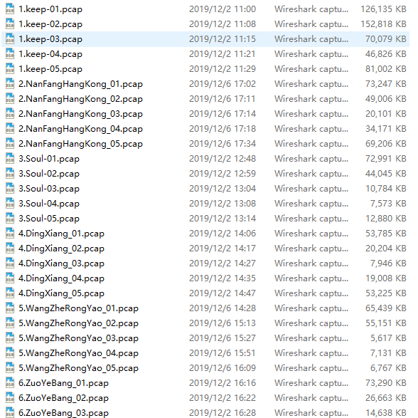
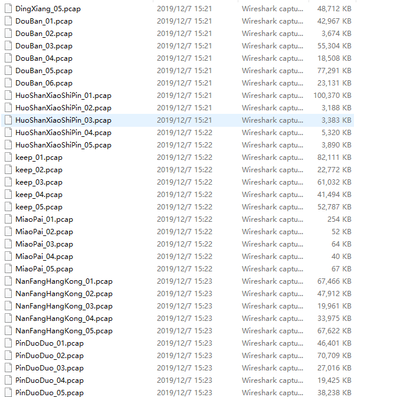
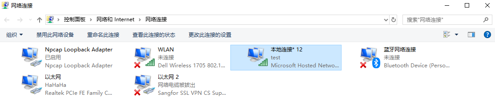
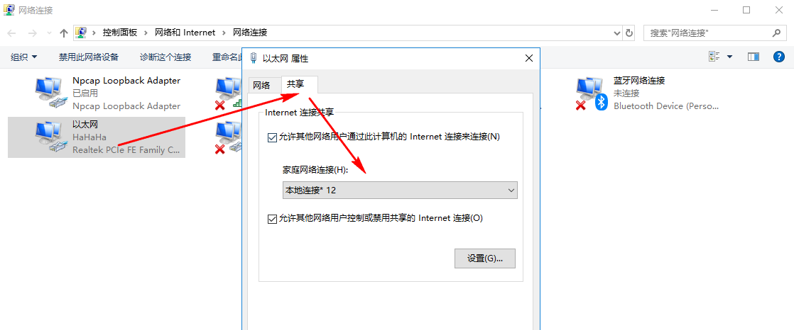

## Windows系统使用

<!--more-->

### 脚本相关
- 批量处理文件夹下指定类型的文件
```sh
@echo off
pushd I:\Research\data\Android\software
for /r %%c in (*.apk) do aapt dump badging %%c >%%c.txt
popd
```
结果如下：


### 使用PowerShell重命名文件

使用正则表达式，寻找文件名中第一次字母出现的位置，进行截断，批量重命名问价：

```powershell
foreach($f in gci pcaps *pcap)
{
	if ($f -match "(?<letter>[a-zA-Z])")
	{
		$a=$($f.BaseName).indexof($Matches.letter)
		$new_name=$($f.BaseName).Substring($a)
		echo $new_name
		$f.MoveTo($f.Name.SubString($a))
	}
}
```

- 重命名之前



- 重命名之后



###  使用windows开启wifi

- 开启虚拟网卡

```sh
# 运行下面的命令检查，显示“支持的承载网络：是（如果支持显示为：是）”；如果为“否”，则请略过本文。
netsh wlan show drivers
# 设置虚拟wifi的ID和密码，之后在网络适配器中将以太网的Adapter共享给新增加的虚拟Adapter
netsh wlan set hostednetwork mode=allow ssid=test_win key=12345678
# 开启虚拟wifi
netsh wlan start hostednetwork
# 关闭wifi
netsh wlan set hostednetwork mode=disallow

```

- 设置共享网络






