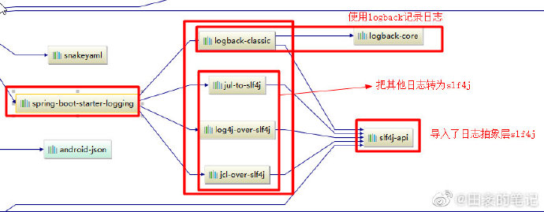
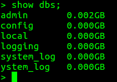
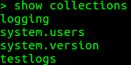

## 1.统一日志框架

在系统开发的过程中,会使用到不同的技术,不同的技术会使用不同的日志框架.为了更好地处理日志信息,首先需要将日志框架进行统一.

<!--more-->



为了将其他的日志框架装换为slf4j,只需要在pom.xml进行如下配置:

```xml
      <!--统一日志框架: Slf4j+logback-->
        <dependency>
            <groupId>ch.qos.logback</groupId>
            <artifactId>logback-classic</artifactId>
        </dependency>
        <dependency>
            <groupId>org.slf4j</groupId>
            <artifactId>jul-to-slf4j</artifactId>
        </dependency>
        <dependency>
            <groupId>org.slf4j</groupId>
            <artifactId>log4j-over-slf4j</artifactId>
        </dependency>
        <dependency>
            <groupId>org.slf4j</groupId>
            <artifactId>jcl-over-slf4j</artifactId>
        </dependency>
```


## 2.Spring Boot连接mongoDB

### (1)mongoDB安装和使用

- 安装---使用docker

- 新建数据库

  - use admin

  

### (2) mongoDB的连接

mongoDB的连接和其他数据库的连接存在一定的差异,主要是体现在mongoDB为每一个数据库设置了用户和密码,在建立建立连接通常采用一下方式.

```java
//spring.data.mongodb.uri=mongodb://用户名:密码t@ip:27017/数据库
MongoClientURI mongoClientURI=new MongoClientURI(mongoUrl);
```


## 3.将日志信息写入mogoDB

### (1)重写logback.xml

```xml
<?xml version="1.0" encoding="UTF-8"?>
<configuration>
    <!-- use Spring default values -->
    <include resource="org/springframework/boot/logging/logback/defaults.xml"/>

    <appender name="CONSOLE" class="ch.qos.logback.core.ConsoleAppender">
        <encoder>
            <pattern>${CONSOLE_LOG_PATTERN}</pattern>
            <charset>utf8</charset>
        </encoder>
    </appender>
    <appender name="MONGODB" class="com.mao.api.util.MongoAppender">
        <collectionName>logging</collectionName>
    </appender>
    <root level="INFO">
        <appender-ref ref="CONSOLE"/>
        <appender-ref ref="MONGODB"/>
    </root>
</configuration>
```

### (2)定义Template

```java
package com.mao.api.core.config;

import com.mongodb.MongoClientURI;
import org.springframework.beans.factory.annotation.Value;
import org.springframework.data.mongodb.MongoDbFactory;
import org.springframework.data.mongodb.core.MongoTemplate;

import org.springframework.data.mongodb.core.SimpleMongoDbFactory;
import org.springframework.data.mongodb.core.convert.DefaultDbRefResolver;
import org.springframework.data.mongodb.core.convert.DefaultMongoTypeMapper;
import org.springframework.data.mongodb.core.convert.MappingMongoConverter;
import org.springframework.data.mongodb.core.mapping.MongoMappingContext;

/**
 * @Classname MongoConfig
 * @Description TODO
 * @Date 19-5-23 下午4:46
 * @Created by mao<tianmao818@qq.com>
 */
//@Configuration
public class MongoConfig {
    @Value("${spring.data.mongodb.uri}")
    private String mongoUrl;

    public MongoTemplate mongoTemplate() {
        MongoClientURI mongoClientURI=new MongoClientURI(mongoUrl);
        MongoDbFactory mongoDbFactory = new SimpleMongoDbFactory(mongoClientURI);
        DefaultDbRefResolver dbRefResolver = new DefaultDbRefResolver(mongoDbFactory);
        MappingMongoConverter converter = new MappingMongoConverter(dbRefResolver, new MongoMappingContext());
        converter.setTypeMapper(new DefaultMongoTypeMapper(null));

        return new MongoTemplate(mongoDbFactory, converter);
    }
}
```

### (3)定义日志Appender(重写append,start,stop,setApplicationContext)

```java
package com.mao.api.util;/**
 * @Classname MongoAppender
 * @Description TODO
 * @Date 19-5-23 下午4:49
 * @Created by mao<tianmao818@qq.com>
 */
import ch.qos.logback.classic.spi.ILoggingEvent;
import ch.qos.logback.core.UnsynchronizedAppenderBase;
import org.slf4j.LoggerFactory;
import org.springframework.beans.BeansException;
import org.springframework.context.ApplicationContext;
import org.springframework.context.ApplicationContextAware;
import org.springframework.data.mongodb.core.MongoTemplate;
import org.springframework.stereotype.Component;

@Component
public class MongoAppender extends UnsynchronizedAppenderBase<ILoggingEvent> implements ApplicationContextAware{
    private static MongoTemplate mongoTemplate;
    private String collectionName;

    @Override
    protected void append(ILoggingEvent event) {
        if (!started) {
            return;
        }
        //日志存储内容
        LogEntity log = new LogEntity();
        log.threadName = event.getThreadName();
        log.level = event.getLevel().levelStr;
        log.formattedMessage = event.getFormattedMessage();
        log.loggerName = event.getLoggerName();
        log.timestamp = event.getTimeStamp();
        //使用模板保存日志
        mongoTemplate.save(log, collectionName);
    }

    @Override
    public void start() {
        super.start();
    }

    @Override
    public void stop() {
        super.stop();
    }

    @Override
    public void setApplicationContext(ApplicationContext applicationContext) throws BeansException {
        if (applicationContext.getAutowireCapableBeanFactory().getBean(MongoTemplate.class) != null) {
            mongoTemplate = applicationContext.getAutowireCapableBeanFactory().getBean(MongoTemplate.class);
            LoggerFactory.getLogger(this.getClass()).info("[ApplicationContext] Autowire MongoTemplate, MongoAppender is ready.");
        }
    }

    private class LogEntity {
        String threadName;
        String level;
        String formattedMessage;
        String loggerName;
        Long timestamp;
    }

    public String getCollectionName() {
        return collectionName;
    }

    public void setCollectionName(String collectionName) {
        this.collectionName = collectionName;
    }
}
```


## 4. 效果

### (1)查看collections



### (2)查看日志细节

