## 足记

简介：每拍一回照片，选一张最喜欢的分享，记录技巧和体会。

<!--more-->

### 2019年11月09日

（中国科学院大学玉泉路校区高能所）

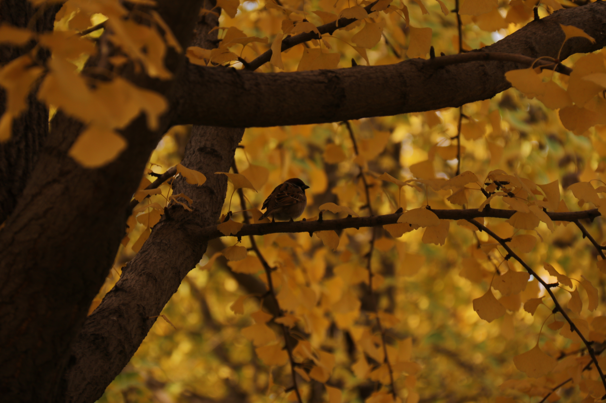</img>

[照片参数](https://github.com/maomao1994/tianmao/blob/master/source/_posts/%E5%85%89%E5%BD%B1%E5%BF%83%E5%BE%97/20191109.jpg.txt)

| 序号 | 总结           |
| ---- | -------------- |
| 1    | 糊片儿了       |
| 2    | 曝光有一点不足 |

### 2019年11月26日

（中国科学院大学玉泉路校区南门天桥）

</img>

[照片参数](https://github.com/maomao1994/tianmao/blob/master/source/_posts/%E5%85%89%E5%BD%B1%E5%BF%83%E5%BE%97/20191126.jpeg.txt)

| 序号 | 总结                                         |
| ---- | -------------------------------------------- |
| 1    | 拍摄位置选的不理想，红绿灯太多，车流不稳定。 |
| 2    | 拍摄时间不太理想，不是车流量高峰。           |

### 2020年02月17日

(湖北省恩施州巴东县)

己亥末，庚子春，楚大疫。

| 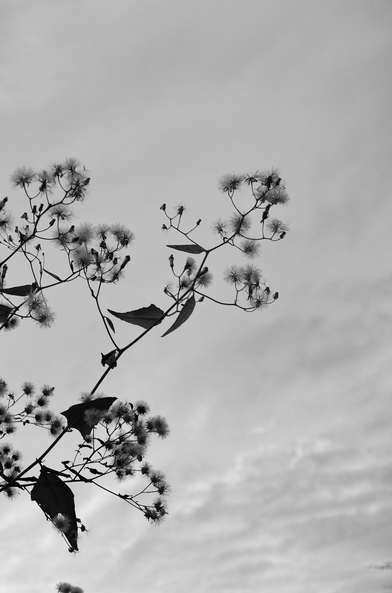</img> | </img> | 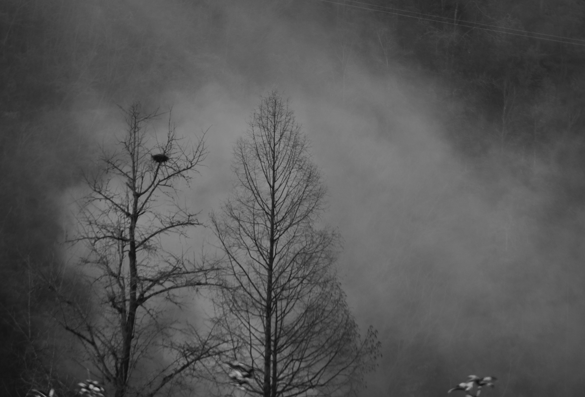</img> |
| ------------------------------------------------------------ | ------------------------------------------------------------ | ------------------------------------------------------------ |
| 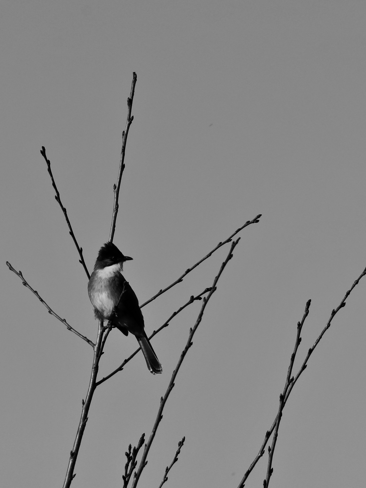</img> | 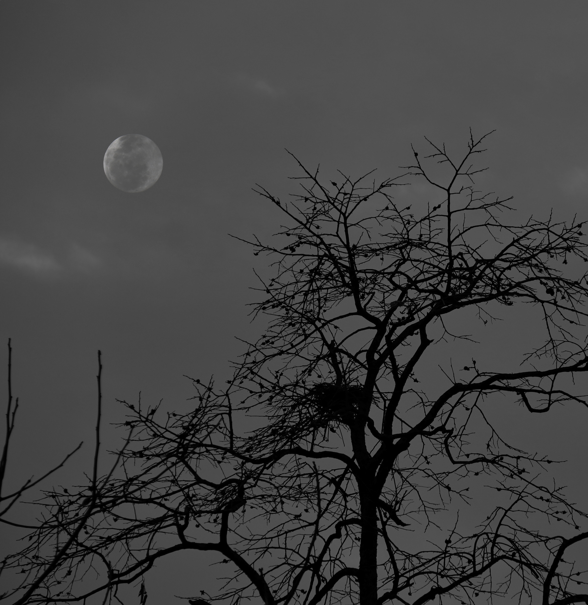</img> | 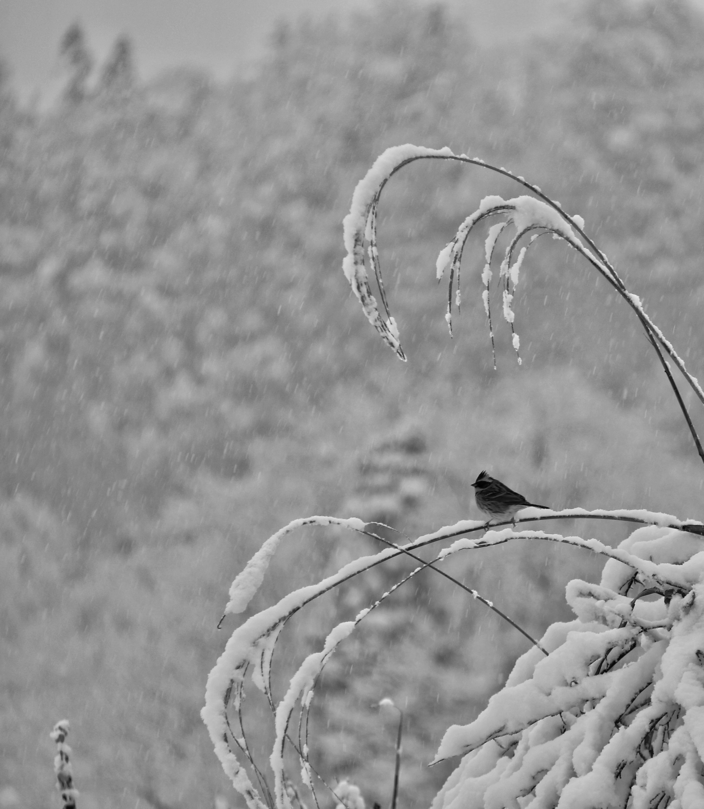</img> |
| 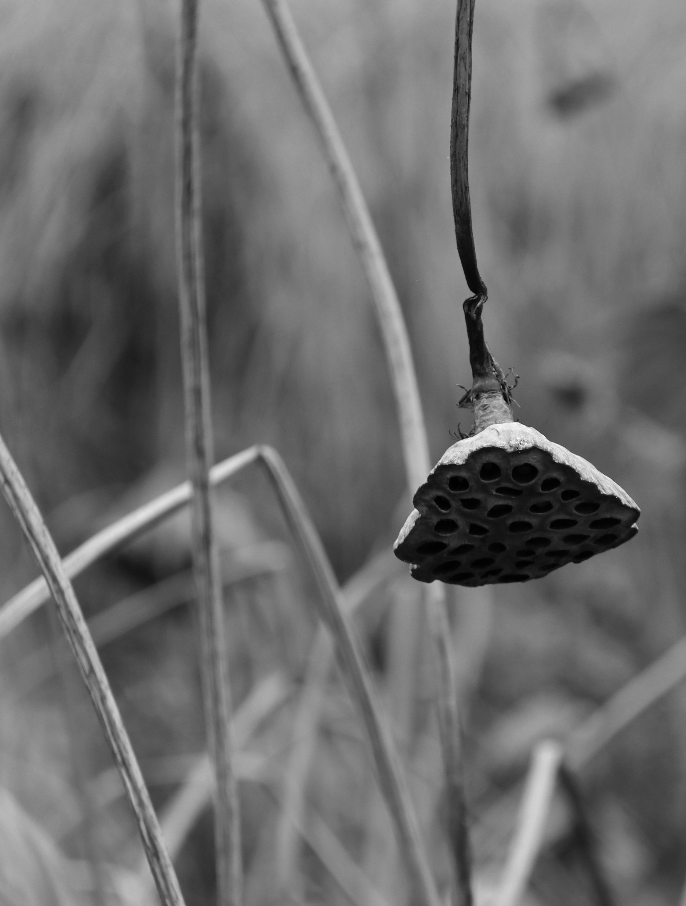</img> | 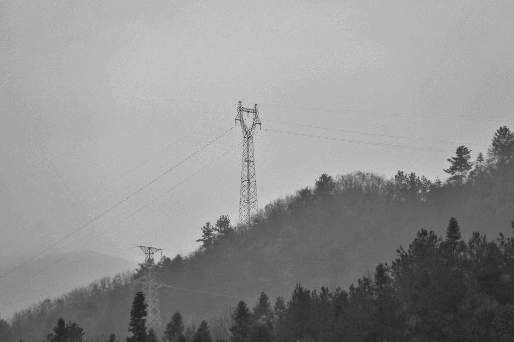</img> | 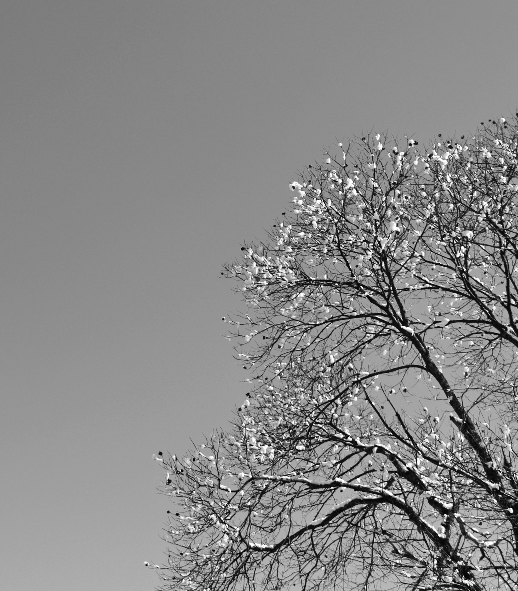</img> |

## 技术

### 单反相机解剖图

</img>
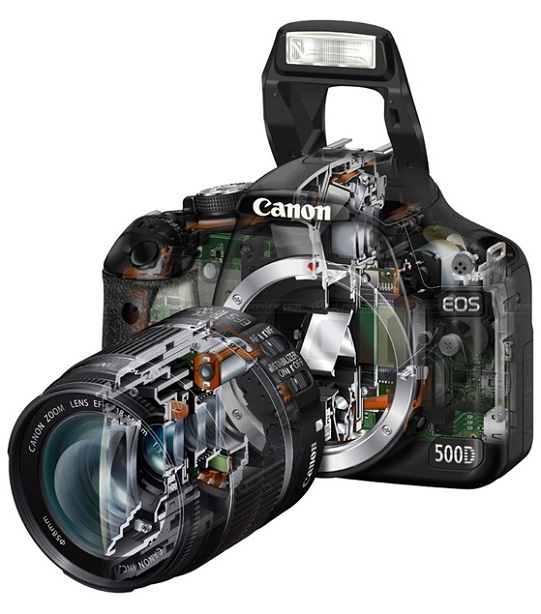</img>

| 英文名                             | 中文名             | 备注 |
| ---------------------------------- | ------------------ | ---- |
| DSLR（Digital Single Lens Reflex） | 单反相机           |      |
| Aperture                           | 光圈               |      |
| Lens                               | 镜头               |      |
| Shutter                            | 快门               |      |
| Exchangeable Image File（Exif）    | exif信息           |      |
| HSL（Hue，Saturation，Lightness）  | 色相、饱和度、亮度 |      |

以下是相机的不同组成部分（材料信息，参数信息）：

#### 感光

</img>

#### 快门

#### 反光板

#### 五棱镜

#### 光圈

### 对比手法

| 对比手法 | 实例 |
| -------- | ---- |
| 明暗对比 |      |
| 动静对比 |      |
| 虚实对比 |      |
| 冷暖对比 |      |
| 主次对比 |      |
| 大小对比 |      |
| 多少对比 |      |
| 高低对比 |      |
| 远近对比 |      |
| 曲直对比 |      |
| 疏迷对比 |      |
| 刚柔对比 |      |

### 构图方法

（摘自宁思潇潇《摄影笔记》）

| 方法     | 实例                                                         |
| -------- | ------------------------------------------------------------ |
| 居中构图 | 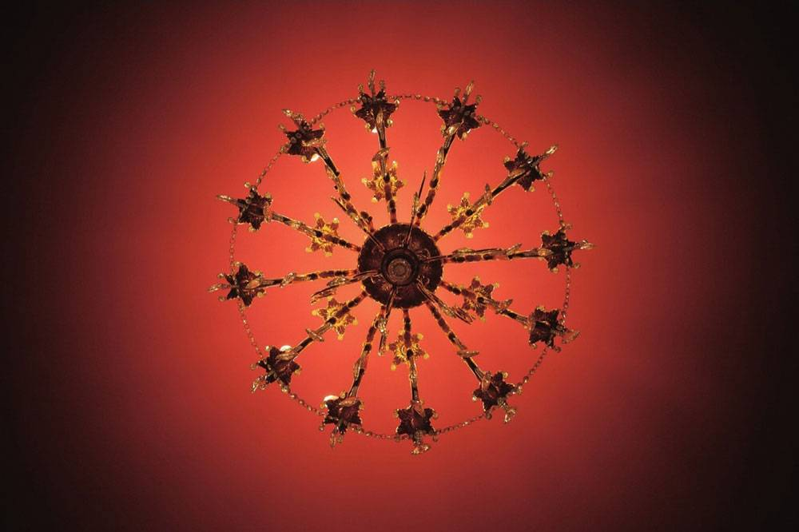</img> |
| 三分构图 | 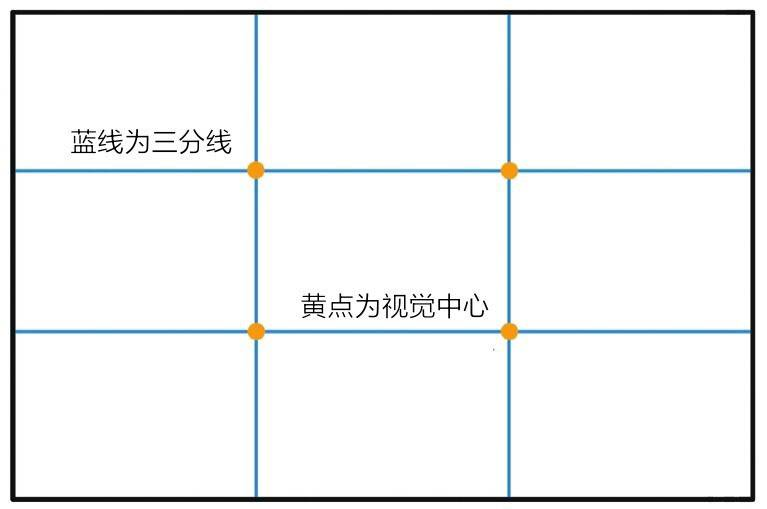</img> |
| 重复法   | 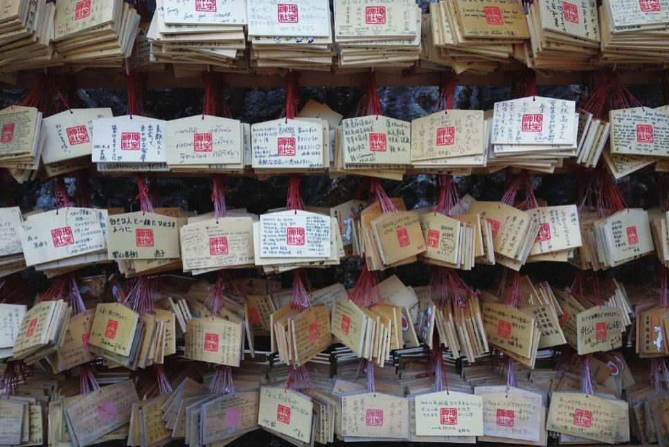</img> |
| 引导线   | 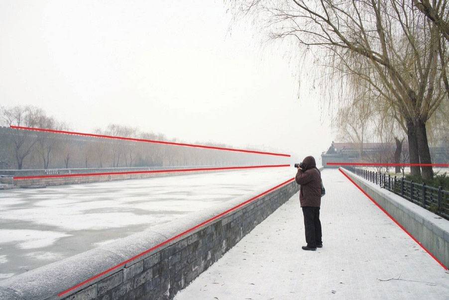</img> |
| 三角构图 | 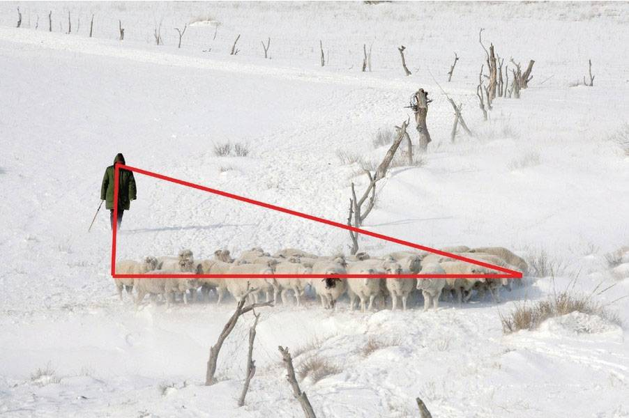</img> |

## 历史

## 人物

| 序号 | 人物                                | 备注                                             | 代表作                                                       |
| ---- | ----------------------------------- | ------------------------------------------------ | ------------------------------------------------------------ |
| 1    | 滨田英明                            |                                                  |                                                              |
| 2    | 宁思潇潇                            |                                                  |                                                              |
| 3    | Tim Walker                          |                                                  |                                                              |
| 4    | BILL GEKAS                          | https://www.billgekas.com/                       |                                                              |
| 5    | W.EUGENE SMITH 尤金·史密斯          |                                                  | 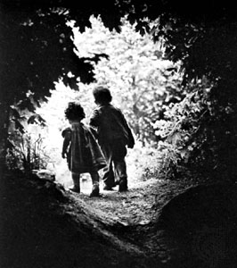</img> |
| 6    | PALPH NIBSON                        |                                                  |                                                              |
| 7    | ANDREAS FEININGER 安德烈亚斯·费宁格 | http://www.artnet.com/artists/andreas-feininger/ |                                                              |
| 8    | MICHAEL KEN                         |                                                  |                                                              |
| 9    | PAUL STRAND 保罗·斯特兰德           |                                                  |                                                              |
| 10   | HIROSHI SUGIMOTO 杉本博司           |                                                  |                                                              |
| 11   | ANSEL ADAMS 安塞尔·伊士顿·亚当斯    |                                                  |                                                              |
| 12   | EDWARD WESTON 爱德华·韦斯顿         |                                                  | 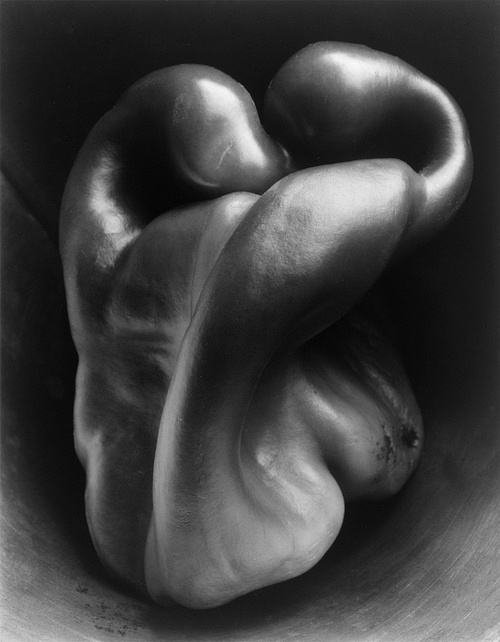</img> |
| 13   |                                     |                                                  |                                                              |
| 14   |                                     |                                                  |                                                              |

## 网站

| 序号 | 网址                                      | 备注                                 |
| ---- | ----------------------------------------- | ------------------------------------ |
| 1    | https://www.format.com/magazine/galleries | format网址，包含一些gallery和magzine |
| 2    | http://www.artnet.com/                    |                                      |

## 工具

| 序号 | 名称                          | 使用                                       | 备注         |
| ---- | ----------------------------- | ------------------------------------------ | ------------ |
| 1    | sudo apt-get install exiftool | exiftool 20191126.jpeg > 20191126.jpeg.txt | 查看exif信息 |
| 2    | Snapseed                      |                                            |              |

## 学习

### 《摄影笔记》-----宁思潇潇

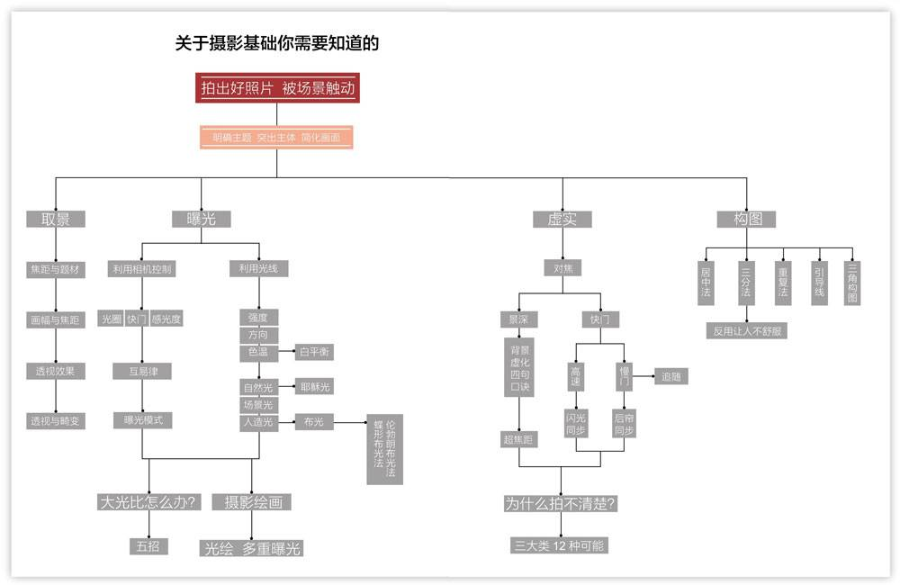</img>

以下是摘录

- 摄影技术诞生于1839年8月19日
- 用摄影来表达
- 摄影和绘画、文字、音乐一样，都是一个载体，将创作者的思想或者意图传递给读者（观众、听众）
- 如果你的内心被一张照片触动到，那么这张照片一定做到了三件事。1.达到并发现某个场景。2.熟练操作相机。3.用自己的摄影技术将这个场景尽可能地进行表达。
- 摄影真正难的是：“达到并发现某一个场景”
- 好照片第一标准------一个好照片必须有一个鲜明的主题
- 好照片的第二个标准------照片必须将注意力引向摄影主题
- 好照片的第三个标准------尽量简洁
- 善于利用相机的一切功能，在具体的场景中，使用最便捷的拍摄模式，用更多的精力去观察取景，而不是调节相机。
- 永远不要忘记，取景，曝光，虚实，构图，就是摄影的一切。而这些都是为了明确主题，突出主体，简化画面二服务的
- 摄影内容远远大于摄影技术
- 摄影技术：取景、曝光、虚实、构图

### 李涛老师摄影后期经典课程

#### 学习方法

| 序号 | 方法               | 备注 |
| ---- | ------------------ | ---- |
| 1    | 取法乎上，寻师经典 |      |
| 2    | 务先大体，鉴比穷源 |      |
| 3    | 诚心正意，自证良知 |      |

#### 发现---联系---重组

- 天下大事，必作于细
- 众生平等，皆有联系
- 情理之中，意料之外

#### 观察力、想象力、创作力

#### 《摄影构图学》

#### 后期步骤

| 序号 | 步骤                     | 备注                   |
| ---- | ------------------------ | ---------------------- |
| 1    | 校准（镜头，畸变）       | 消除色差，启动镜头配置 |
| 2    | 准确的色彩还原（白平衡） |                        |
| 3    | 正确的黑白场             |                        |
| 4    | 足够的清晰度             |                        |
| 5    | 适当的饱和度             |                        |
| 6    | 丰富合理的层次           |                        |
| 7    | 局部调节                 | 画笔、镜像、渐变       |

#### 互补色

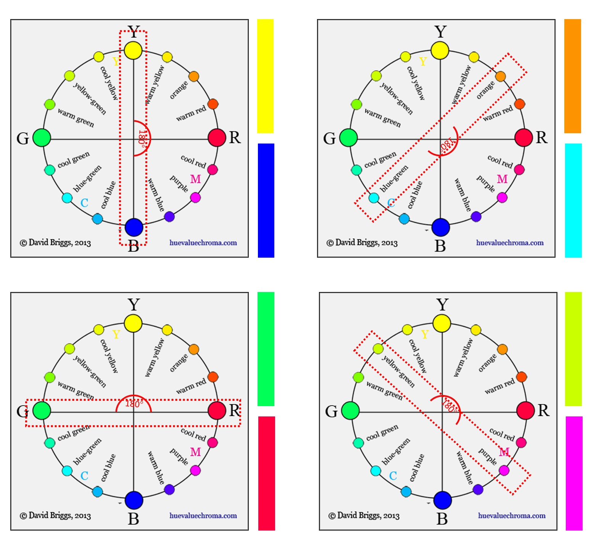</img>

#### 要有目的地做后期

#### 影调

| **高短** | **高中** | **高长** |
| -------- | -------- | -------- |
| **中短** | **中中** | **中长** |
| **低短** | **低中** | **低长** |

