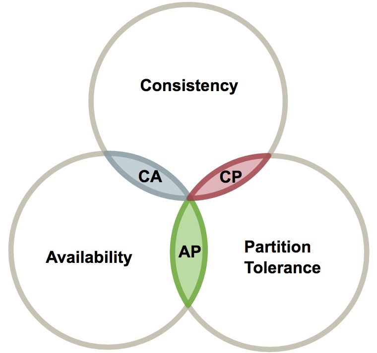

单数据源的一致性依靠单机事务保证，多数据源的一致性由分布式事务保证。

<!--more-->

# 原理

## 事务

### 原子性

### 一致性

### 隔离性

### 持久性

## 两将军问题

## CAP

CAP原则又称CAP定理，指的是在一个分布式系统中， Consistency（一致性）、 Availability（可用性）、Partition tolerance（分区容错性），三者不可得兼。

In [theoretical computer science](https://en.wikipedia.org/wiki/Theoretical_computer_science), the **CAP theorem**, also named **Brewer's theorem** after computer scientist [Eric Brewer](https://en.wikipedia.org/wiki/Eric_Brewer_(scientist)), states that it is impossible for a [distributed data store](https://en.wikipedia.org/wiki/Distributed_data_store) to simultaneously provide [more than two out of the following three](https://en.wikipedia.org/wiki/Trilemma) guarantees.

</img>

## BASE

BASE是Basically Available（基本可用）、Soft state（软状态）和Eventually consistent（最终一致性）三个短语font>的简写，BASE是对CAP中一致性和可用性权衡的结果，其来源于对大规模互联网系统分布式实践的结论，是基于CAP定理逐步演化而来的，其核心思想是即使无法做到强一致性（Strong consistency），但每个应用都可以根据自身的业务特点，采用适当的方式来使系统达到最终一致性（Eventual consistency）。

## XA，JXA

XA协议包含**两阶段提交（2PC）**和**三阶段提交（3PC）**两种实现

# 解决方案

## 两阶段提交(2PC)

两阶段提交（Two-phase Commit，2PC），通过引入协调者（Coordinator）来协调参与者的行为，并最终决定这些参与者是否要真正执行事务。

### 过程

#### 准备

首先协调者询问参与者事务是否执行成功，参与者发回事务执行结果。

#### 提交或者回滚

然后如果事务在每个参与者上都执行成功，事务协调者发送通知让参与者提交事务；否则，协调者发送通知让参与者回滚事务。(标黄的部分可能会失败)

### 具体实现

### 协调者如何来通信的？

### 存在的问题

#### 同步阻塞

所有事务参与者在等待其它参与者响应的时候都处于同步阻塞状态，无法进行其它操作。

#### 单点问题

协调者存在挂掉的风险。

#### 数据不一致

如果在第二阶段，因为网络问题，出现只有部分commit的情况，但是此时并没有回滚。

## 补偿事务(TCC)

### 过程

TCC 其实就是采用的补偿机制，其核心思想是：针对每个操作，都要注册一个与其对应的确认和补偿（撤销）操作。它分为三个阶段：

- Try 阶段主要是对业务系统做检测及资源预留
- Confirm 阶段主要是对业务系统做确认提交，Try阶段执行成功并开始执行 Confirm阶段时，默认 Confirm阶段是不会出错的。即：只要Try成功，Confirm一定成功。
- Cancel 阶段主要是在业务执行错误，需要回滚的状态下执行的业务取消，预留资源释放。

举个例子，假入 Bob 要向 Smith 转账，思路大概是： 我们有一个本地方法，里面依次调用

1. 首先在 Try 阶段，要先调用远程接口把 Smith 和 Bob 的钱给冻结起来。
2. 在 Confirm 阶段，执行远程调用的转账的操作，转账成功进行解冻。
3. 如果第2步执行成功，那么转账成功，如果第二步执行失败，则调用远程冻结接口对应的解冻方法 (Cancel)。

### 存在的问题

#### 数据一致性问题

## MQ事务

