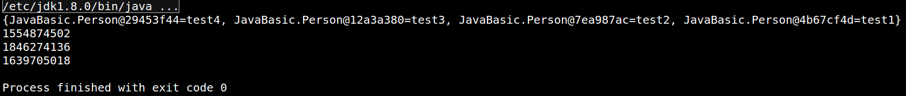

算法基础训练。

<!--more-->

## 实现BitMap

```java
package JavaBasic;/**
 * @Classname BitMap
 * @Description 实现BItMap
 * @Date 19-6-19 下午7:49
 * @Created by mao<tianmao818@qq.com>
 */
public class BitMap {
    /** 插入数的最大长度，比如100，那么允许插入bitsMap中的最大数为99 */
    private long length;

    //每一个int表示32位
    private static int[] bitsMap;

    //长度为32,0-31每一位单独为1的时候的数值
    private static final int[] BIT_VALUE = { 0x00000001, 0x00000002, 0x00000004, 0x00000008, 0x00000010, 0x00000020,
            0x00000040, 0x00000080, 0x00000100, 0x00000200, 0x00000400, 0x00000800, 0x00001000, 0x00002000, 0x00004000,
            0x00008000, 0x00010000, 0x00020000, 0x00040000, 0x00080000, 0x00100000, 0x00200000, 0x00400000, 0x00800000,
            0x01000000, 0x02000000, 0x04000000, 0x08000000, 0x10000000, 0x20000000, 0x40000000, 0x80000000 };

    //长度等于最大数除以32
    public BitMap(long length) {
        this.length = length;
        // 根据长度算出，所需数组大小
        bitsMap = new int[(int) (length >> 5) + ((length & 31) > 0 ? 1 : 0)];
    }


    /**
     * 根据长度获取数据 比如输入63，那么实际上是确定数62是否在bitsMap中
     *
     * @return index 数的长度
     * @return 1:代表数在其中 0:代表
     */
    public int getBit(long index) {
        if (index < 0 || index > length) {
            throw new IllegalArgumentException("length value illegal!");
        }

        int intData = (int) bitsMap[(int) ((index - 1) >> 5)];

        //(index - 1) & 31表示的是偏移
        //((intData & BIT_VALUE[(int) ((index - 1) & 31)]))表示这个值存在不存在
        //右移是为了将数值转换到0和1之间
        return ((intData & BIT_VALUE[(int) ((index - 1) & 31)])) >>> ((index - 1) & 31);
    }


    /**
     * @param index
     *            要被设置的值为index - 1
     */
    public void setBit(long index) {

        //防止越界
        if (index < 0 || index > length) {
            throw new IllegalArgumentException("length value illegal!");
        }
        // 求出该index - 1所在bitMap的下标
        int belowIndex = (int) ((index - 1) >> 5);

        // 求出该值的偏移量(求余)
        int offset = (int) ((index - 1) & 31);

        //inData是一个大的整数
        int inData = bitsMap[belowIndex];

        //将特定位置为1
        bitsMap[belowIndex] = inData | BIT_VALUE[offset];
    }


    public static void main(String[] args) {
        //设置最大的表示范围
        BitMap bitMap = new BitMap(129);
        bitMap.setBit(63);
        System.out.println(bitMap.getBit(63));
        System.out.println(bitMap.getBit(62));
    }
}

```

## 使用中缀表达式实现计算器

```java
package CommonProblems.StackProblems;

import java.io.File;
import java.io.FileNotFoundException;
import java.util.ArrayList;
import java.util.Scanner;
import java.util.Stack;

/**
 * @Author MaoTian
 * @Classname CalculatorDemo
 * @Description 表达式的计算，使用两个栈建立后缀表达式，通过后缀表达式进行求值0
 * 操作符是以中缀形式处于操作数的中间（例：3 + 4）。
 * 前缀表达式（例：+ 3 4）
 * 后缀表达式（例：3 4 +）
 * @Date 下午3:25 2019/9/12
 * @Version 1.0
 * @Created by mao<tianmao818@qq.com>
 */


public class CalculatorDemo {

    public static void main(String[] args) throws FileNotFoundException {

        //Scanner sc=new Scanner(System.in);
        Scanner sc=new Scanner(new File("/home/mao/workspace/java/src/CommonProblems/StackProblems/CalculatorDemo"));

        while(sc.hasNext()){
            String s=sc.nextLine();
            s=s.replaceAll("\\{", "(");
            s=s.replaceAll("\\[", "(");
            s=s.replaceAll("\\}", ")");
            s=s.replaceAll("\\]", ")");

            //保存操作数和符号
            ArrayList<String> list=new ArrayList<>();

            //预处理
            char[] c=s.toCharArray();
            int i=0;
            while(i<c.length){
                int k=0;
                while(k+i<c.length && c[i+k]>='0' && c[i+k]<='9'){
                    k++;
                }
                if(k!=0){
                    //添加数字
                    list.add(String.copyValueOf(c, i, k));
                    i=i+k;
                }
                else{
                    //添加符号：括号和操作符号
                    list.add(String.copyValueOf(c, i, 1));
                    i++;
                }
            }

            //一个+-*/对应着两个数字
            ArrayList<String> list1=new ArrayList<>();
            for(int j=0; j<list.size(); j++){

                //对负数-N进行特殊的处理，改为0-N
                if(list.get(j).equals("-")){
                    if(j==0){
                        list1.add("0");
                    }
                    else{
                        if(list.get(j-1).equals("(")){
                            list1.add("0");
                        }
                    }
                }

                list1.add(list.get(j));
            }

            System.out.println("-----------------------------------------------");
            for (String cc:list1){
                System.out.print(cc+" ");
            }
            System.out.println();
            System.out.println("-----------------------------------------------");

            System.out.println(computeNum(list1));
        }

    }

    //获取后缀表达式
    //将中缀表达式（即标准的表达式）转换为后缀表达式:
    // 1 + 2 * 3 + ( 4 * 5 + 6 ) * 7 转换成 1 2 3 * + 4 5 * 6 + 7 * +
    /*
    首先，读入‘1’，并送到输出，然后‘+’被读入并压入栈中。接下来‘2’读入并送到输出，此时状态如下：
    栈：+
    输出：1 2

    接下来读入‘*’，由于优先级比栈顶元素‘+’大（原则3），因此被压入栈中，接着读入‘3’，并送到输出：
    栈：+ *
    输出：1 2 3

    然后读入‘+’，由于此时栈顶元素为‘*’，优先级比‘+’大，因此将‘*’弹出，弹出后原来的‘+’变为栈顶元素，由于‘+’的优先级和当前读入的‘+’优先级相等，因此也被弹出（原则3），最后将读入的‘+’压入栈中，因此状态如下：
    栈：+
    输出：1 2 3 * +

    下一个读入的符号‘（’，由于具有最高优先级，因此将其放入栈中，然后读入‘4’：
    栈：+ （
    输出： 1 2 3 * + 4

    继续读入，此时读入‘*’，除非处理‘）’，否则‘（’绝不会弹出，因此‘*’被压入栈中，接下来读入‘5’：
    栈：+ （*
    输出：1 2 3 * + 4 5

    往后读入的符号是‘+’，将‘*’弹出并输出。然后将‘+’压入栈中，接着读入‘6’：
    栈：+ （ +
    输出：1 2 3 * + 4 5 * 6

    现在读入‘）’，因此弹出栈中元素直到遇到‘（’：
    栈：+
    输出：1 2 3 * + 4 5 * 6 +

    下一个有读入‘*’，被压入栈中，然后读入‘7’：
    栈：+ *
    输出：1 2 3 * + 4 5 * 6 + 7

    现在输入为空，弹出所有栈中元素
    栈：空
    输出：1 2 3 * + 4 5 * 6 + 7 * +
    * */
    public static String[] getPostfixExpression(ArrayList<String> list){
        //使用两个栈
        Stack<String> s1=new Stack<>();
        Stack<String> s2=new Stack<>();
        int i=0;

        while(i<list.size()){

            //括号的优先级最高
            if(list.get(i).equals("(")){
                s2.add(list.get(i));
                i++;
                continue;
            }
            //加减
            if(list.get(i).equals("+") || list.get(i).equals("-")){
                while(!s2.isEmpty() && !s2.peek().equals("(")){
                    s1.add(s2.pop());
                }
                s2.add(list.get(i));
                i++;
                continue;
            }
            //乘除
            if(list.get(i).equals("*") || list.get(i).equals("/")){
                while(!s2.isEmpty() && (s2.peek().equals("*") || s2.peek().equals("/"))){
                    s1.add(s2.pop());
                }
                s2.add(list.get(i));
                i++;
                continue;
            }
            if(list.get(i).equals(")")){
                while(!s2.isEmpty() && !s2.peek().equals("(")){
                    s1.add(s2.pop());
                }
                s2.pop();
                i++;
                continue;
            }
            s1.add(list.get(i));
            i++;
        }
        while(!s2.isEmpty()){
            s1.add(s2.pop());
        }

        String[] c=new String[s1.size()];
        for(int j=c.length-1; j>=0; j--){
            c[j]=s1.pop();
        }

        System.out.println("-----------------------------------------------");
        for (String cc:c){
            System.out.print(cc+" ");
        }
        System.out.println();
        System.out.println("-----------------------------------------------");

        return c;
    }


    //通过后缀表达式求值,从栈中取元素，进行计算，计算完后入栈
    public static int computeNum(ArrayList<String> list){

        //获得后缀表达式
        String[] c=getPostfixExpression(list);
        //保存计算的结果
        Stack<Integer> s=new Stack<>();
        for(int i=0; i<c.length; i++){
            int t1, t2;
            if(c[i].equals("+")){
                t1=s.pop();
                t2=s.pop();
                s.add(t2+t1);
                continue;
            }
            if(c[i].equals("-")){
                t1=s.pop();
                t2=s.pop();
                s.add(t2-t1);
                continue;
            }
            if(c[i].equals("*")){
                t1=s.pop();
                t2=s.pop();
                s.add(t2*t1);
                continue;
            }
            if(c[i].equals("/")){
                t1=s.pop();
                t2=s.pop();
                s.add(t2/t1);
                continue;
            }
            //数字入栈
            s.add(Integer.parseInt(c[i]));
        }
        return s.pop();
    }
}
```


## 二叉树的遍历

### 前序遍历

#### 递归

- java实现

```
    public void preorder1(BinaryTreeNode root){
        if (root==null)
            return;
        System.out.print(root.getData()+"\t");
        preorder1(root.getLeft());
        preorder1(root.getRight());
    }
```

#### 循环(使用栈)

- java实现

```
    public void preorder2(BinaryTreeNode root){
        Stack<BinaryTreeNode>stack =new Stack<BinaryTreeNode>();
        if (root==null)
            return;
        BinaryTreeNode cur;
        cur=root;
        while(cur!=null||!stack.isEmpty()){
            if (cur!=null){
                System.out.print(cur.getData()+"\t");
                stack.push(cur);
                cur=cur.getLeft();
            }else{
                cur=stack.peek();
                stack.pop();
                cur=cur.getRight();
            }
        }
    }
```

### 中序遍历

#### 递归

- java实现

```
    public void inorder1(BinaryTreeNode root){
        if (root==null)
            return;
        inorder1(root.getLeft());
        System.out.print(root.getData()+"\t");
        inorder1(root.getRight());
    }
```

#### 循环(使用栈)

- java实现

```
    public void inorder2(BinaryTreeNode root){
        Stack<BinaryTreeNode>stack =new Stack<BinaryTreeNode>();
        if(root==null)
            return;
        BinaryTreeNode cur=root;
        while(cur!=null||!stack.isEmpty()){
            if(cur!=null){
                stack.push(cur);
                cur=cur.getLeft();
            }else{
                cur=stack.peek();
                stack.pop();
                System.out.print(cur.getData()+"\t");
                cur=cur.getRight();
            }
        }
    }
```

### 后序遍历

#### 递归

- java实现

```
    public void postorder1(BinaryTreeNode root){
        if (root==null)
            return;
        postorder1(root.getLeft());
        postorder1(root.getRight());
        System.out.print(root.getData()+"\t");
    }
```

#### 循环(使用栈)

- java实现

```
   public void postorder2(BinaryTreeNode root){
        Stack<BinaryTreeNode> stack=new Stack<BinaryTreeNode>();
        while (true){
            if(root!=null){
                stack.push(root);
                root=root.getLeft();
            }
            else {
                if(stack.isEmpty())
                    return;
                if(stack.lastElement().getRight()==null){
                    root=stack.pop();
                    System.out.print(root.getData()+"\t");
                    while (stack.lastElement().getRight()==root){
                        System.out.print(stack.lastElement().getData()+"\t");
                        root=stack.pop();
                        if (stack.isEmpty()){
                            break;
                        }
                    }
                }
                if(!stack.isEmpty())
                    root=stack.lastElement().getRight();
                else
                    root=null;
            }
        }
    }
    public void postorder3(BinaryTreeNode root){
        if(root==null)
            return;
        Stack<BinaryTreeNode> stack=new Stack<BinaryTreeNode>();
        BinaryTreeNode cur;
        cur=root;
        List<Integer> res=new ArrayList<>();

        while (cur!=null||!stack.isEmpty()){
            if (cur!=null){
                res.add(cur.getData());
                stack.push(cur);
                cur=cur.getRight();
            }else{
                cur=stack.peek();
                stack.pop();
                cur=cur.getLeft();
            }

        }
        Collections.reverse(res);
        for (Integer i:res){
            System.out.print(i+"\t");
        }
    }
```

### 测试

#### 建立二叉树

- java实现

```
package BinaryTree;
import BinaryTree.BinaryTreeNode;

import java.net.PortUnreachableException;

public class ConstructBinaryTree {

    public static BinaryTreeNode construct1(int[] preOrder,int[] inOrder, int length){
        if(preOrder==null||inOrder==null||length<0){
            return null;
        }
        try {
            return ConstructCore1(preOrder, 0, preOrder.length - 1, inOrder, 0,inOrder.length - 1);
        }catch (Exception e){
            return null;
        }
    }


    public static BinaryTreeNode ConstructCore1(int[] preOrder,int startPreIndex, int endPreIndex,
                                               int[] inOrder,int startInIndex, int endInIndex) throws InvalidPutException {
        int rootValue = preOrder[startPreIndex];
        BinaryTreeNode root = new BinaryTreeNode(rootValue,null,null);
        // 在中序遍历中找到根结点的索引
        int rootInIndex = startInIndex;
        while (rootInIndex <= endInIndex && inOrder[rootInIndex] != rootValue) {
            ++rootInIndex;
        }
        if (rootInIndex == endInIndex && inOrder[rootInIndex] != rootValue) {
            throw new InvalidPutException();
        }
        int leftLength = rootInIndex - startInIndex;
        int leftPreOrderEndIndex = startPreIndex + leftLength;
        if (leftLength > 0) {
            // 构建左子树
            root.setLeft( ConstructCore1(preOrder, startPreIndex + 1,
                    leftPreOrderEndIndex, inOrder, startInIndex,
                    rootInIndex - 1));
        }

        if (leftLength < endPreIndex - startPreIndex) {
            // 右子树有元素,构建右子树
            root.setRight(ConstructCore1(preOrder, leftPreOrderEndIndex + 1,
                    endPreIndex, inOrder, rootInIndex + 1, endInIndex));
        }
        return root;
    }

    public static BinaryTreeNode construct2(int[] postOrder,int[] inOrder,int length){
        return ConstructCore2(postOrder,0,postOrder.length-1,inOrder,0,inOrder.length-1);
    }
    public static BinaryTreeNode ConstructCore2(int[] postOrder,int startPostIndex,int endPostIndex,int[] inOrder,int startInIndex,int endInIndex){
        int rootValue=postOrder[endPostIndex];
        BinaryTreeNode root=new BinaryTreeNode(rootValue,null,null);

        int rootInIndex=startInIndex;
        while(rootInIndex<=endInIndex&&inOrder[rootInIndex]!=rootValue){
            ++rootInIndex;
        }

        int leftLength=rootInIndex-startInIndex;
        int rightLength=endInIndex-rootInIndex;

        int leftPostOrderEndIndex=startPostIndex+leftLength-1;
        if(leftLength>0){
            root.setLeft(ConstructCore2(postOrder,startPostIndex,leftPostOrderEndIndex,inOrder,startInIndex,rootInIndex-1));
        }
        if(rightLength>0){
            root.setRight(ConstructCore2(postOrder,rootInIndex,endPostIndex-1,inOrder,rootInIndex+1,endInIndex));
        }

        return root;
    }

    static class InvalidPutException extends Exception {
        private static final long serialVersionUID = 1L;
    }

    public static void main(String[] argv){
        int[] preOrder={1,2,4,5,8,9,10,3,6,7};
        int[] inOrder={4,2,8,5,9,10,1,6,3,7};
        int[] postOrder={4,8,10,9,5,2,6,7,3,1};
        BinaryTreeNode root=ConstructBinaryTree.construct1(preOrder,inOrder,10);
        BinaryTreeNode root2=ConstructBinaryTree.construct2(postOrder,inOrder,10);
        Traversal traversal=new Traversal();
        System.out.println("preOrder+inOrder");
        traversal.postorder3(root);
        System.out.println();
        System.out.println("postOrder+inOrder");
        traversal.preorder1(root2);
    }
    
}
```

### 完整java代码

- 完整

```
package BinaryTree;

public class BinaryTreeNode {
    private int data;
    private BinaryTreeNode left;
    private BinaryTreeNode right;

    public BinaryTreeNode(int data, BinaryTreeNode left, BinaryTreeNode right) {
        super();
        this.data = data;
        this.left = left;
        this.right = right;
    }

    public int getData() {
        return data;
    }

    public void setData(int data) {
        this.data = data;
    }

    public BinaryTreeNode getLeft() {
        return left;
    }

    public void setLeft(BinaryTreeNode left) {
        this.left = left;
    }

    public BinaryTreeNode getRight() {
        return right;
    }

    public void setRight(BinaryTreeNode right) {
        this.right = right;
    }
}


package BinaryTree;
import BinaryTree.BinaryTreeNode;

import java.util.*;

public class Traversal {


    public void preorder1(BinaryTreeNode root){
        if (root==null)
            return;
        System.out.print(root.getData()+"\t");
        preorder1(root.getLeft());
        preorder1(root.getRight());
    }
    public void preorder2(BinaryTreeNode root){
        Stack<BinaryTreeNode>stack =new Stack<BinaryTreeNode>();
        if (root==null)
            return;
        BinaryTreeNode cur;
        cur=root;
        while(cur!=null||!stack.isEmpty()){
            if (cur!=null){
                System.out.print(cur.getData()+"\t");
                stack.push(cur);
                cur=cur.getLeft();
            }else{
                cur=stack.peek();
                stack.pop();
                cur=cur.getRight();
            }
        }
    }
    public void inorder1(BinaryTreeNode root){
        if (root==null)
            return;
        inorder1(root.getLeft());
        System.out.print(root.getData()+"\t");
        inorder1(root.getRight());
    }
    public void inorder2(BinaryTreeNode root){
        Stack<BinaryTreeNode>stack =new Stack<BinaryTreeNode>();
        if(root==null)
            return;
        BinaryTreeNode cur=root;
        while(cur!=null||!stack.isEmpty()){
            if(cur!=null){
                stack.push(cur);
                cur=cur.getLeft();
            }else{
                cur=stack.peek();
                stack.pop();
                System.out.print(cur.getData()+"\t");
                cur=cur.getRight();
            }
        }
    }
    public void postorder1(BinaryTreeNode root){
        if (root==null)
            return;
        postorder1(root.getLeft());
        postorder1(root.getRight());
        System.out.print(root.getData()+"\t");
    }
    public void postorder2(BinaryTreeNode root){
        Stack<BinaryTreeNode> stack=new Stack<BinaryTreeNode>();
        while (true){
            if(root!=null){
                stack.push(root);
                root=root.getLeft();
            }
            else {
                if(stack.isEmpty())
                    return;
                if(stack.lastElement().getRight()==null){
                    root=stack.pop();
                    System.out.print(root.getData()+"\t");
                    while (stack.lastElement().getRight()==root){
                        System.out.print(stack.lastElement().getData()+"\t");
                        root=stack.pop();
                        if (stack.isEmpty()){
                            break;
                        }
                    }
                }
                if(!stack.isEmpty())
                    root=stack.lastElement().getRight();
                else
                    root=null;
            }
        }
    }
    public void postorder3(BinaryTreeNode root){
        if(root==null)
            return;
        Stack<BinaryTreeNode> stack=new Stack<BinaryTreeNode>();
        BinaryTreeNode cur;
        cur=root;
        List<Integer> res=new ArrayList<>();

        while (cur!=null||!stack.isEmpty()){
            if (cur!=null){
                res.add(cur.getData());
                stack.push(cur);
                cur=cur.getRight();
            }else{
                cur=stack.peek();
                stack.pop();
                cur=cur.getLeft();
            }

        }
        Collections.reverse(res);
        for (Integer i:res){
            System.out.print(i+"\t");
        }
    }
    public void levelorder(BinaryTreeNode root){
        BinaryTreeNode temp;
        Queue<BinaryTreeNode> queue=new LinkedList<BinaryTreeNode>();
        queue.offer(root);
        while (!queue.isEmpty()){
            temp=queue.poll();
            System.out.print(temp.getData()+"\t");
            if(temp.getLeft()!=null){
                queue.offer(temp.getLeft());
            }
            if(temp.getRight()!=null){
                queue.offer(temp.getRight());
            }
        }
    }
    public static void main(String[] args){
        BinaryTreeNode node10=new BinaryTreeNode(10,null,null);
        BinaryTreeNode node8=new BinaryTreeNode(8,null,null);
        BinaryTreeNode node9=new BinaryTreeNode(9,null,node10);
        BinaryTreeNode node4=new BinaryTreeNode(4,null,null);
        BinaryTreeNode node5=new BinaryTreeNode(5,node8,node9);
        BinaryTreeNode node6=new BinaryTreeNode(6,null,null);
        BinaryTreeNode node7=new BinaryTreeNode(7,null,null);
        BinaryTreeNode node2=new BinaryTreeNode(2,node4,node5);
        BinaryTreeNode node3=new BinaryTreeNode(3,node6,node7);
        BinaryTreeNode node1=new BinaryTreeNode(1,node2,node3);


        Traversal traversal=new Traversal();


        System.out.println("---pre order---");
        traversal.preorder1(node1);
        System.out.println();
        traversal.preorder2(node1);
        System.out.println();

        System.out.println("---in order---");
        traversal.inorder1(node1);
        System.out.println();
        traversal.inorder2(node1);
        System.out.println();

        System.out.println("---post order---");
        traversal.postorder1(node1);
        System.out.println();
        traversal.postorder2(node1);
        System.out.println();
        traversal.postorder3(node1);
        System.out.println();

        System.out.println("---level order---");
        traversal.levelorder(node1);
        System.out.println();
    }
}

```

## 生产者消费者

### 要点

- 1 线程    操作   资源类
- 2 判断    干活   通知
- 3 虚假唤醒（必须使用while进行循环）

### 传统方法：使用synchronized

```java
package JavaDemo.MultiThreadTest;

/**
 * @Author MaoTian
 * @Classname ProducerConsumerSync
 * @Description TODO
 * @Date 上午8:48 2019/8/9
 * @Version 1.0
 * @Created by mao<tianmao818@qq.com>
 */
class ShareSource{
    private int number=0;
    public synchronized void increment()throws InterruptedException{
        while (number!=0){
            this.wait();
        }
        ++number;
        System.out.println(Thread.currentThread().getName()+"\t"+number);
        this.notifyAll();
    }
    public synchronized void decrement()throws InterruptedException{
        while (number==0){
            this.wait();
        }
        --number;
        System.out.println(Thread.currentThread().getName()+"\t"+number);
        this.notifyAll();
    }
}
public class ProducerConsumerSync {
    public static void main(String[] args) {
        ShareSource shareSource=new ShareSource();
        new Thread(()->{
            for (int i = 0; i <10 ; i++) {
                try {
                    shareSource.increment();
                }catch (Exception e){

                }
            }
        },"producer3").start();
        new Thread(()->{
            for (int i = 0; i <10 ; i++) {
                try {
                    shareSource.decrement();
                }catch (Exception e){

                }
            }
        },"consumer").start();
    }
}

```


### 使用Lock

```java
package JavaDemo.MultiThreadTest;

import java.util.concurrent.locks.Condition;
import java.util.concurrent.locks.Lock;
import java.util.concurrent.locks.ReentrantLock;

/**
 * @Author MaoTian
 * @Classname ProducerConsumerTraditional
 * @Description 交替操作，一个加，一个减
 * 1 线程    操作   资源类
 * 2 判断    干活   通知
 * 3 虚假唤醒（必须使用while进行循环）
 * @Date 下午7:40 2019/8/8
 * @Version 1.0
 * @Created by mao<tianmao818@qq.com>
 */

class ShareData{
    private int number=0;
    private Lock lock=new ReentrantLock();
    private Condition condition=lock.newCondition();
    public void increment()throws Exception{
        lock.lock();
        try{
            //判断
            while (number!=0){
                //等待
                condition.await();
            }
            //干活
            number++;
            System.out.println(Thread.currentThread().getName()+":"+number);
            //通知
            condition.signalAll();
        }catch (Exception e){
        }finally {
            lock.unlock();
        }
    }
    public void decrement()throws Exception{
        lock.lock();
        try{
            //判断
            while (number==0){
                //等待
                condition.await();
            }
            //干活
            number--;
            System.out.println(Thread.currentThread().getName()+":"+number);
            //通知
            condition.signalAll();
        }catch (Exception e){
        }finally {
            lock.unlock();
        }
    }
}
public class ProducerConsumerTraditional {
    public static void main(String[] args) {
        ShareData shareData=new ShareData();
        new Thread(()->{
            for (int i = 0; i < 5; i++) {
                try {
                    shareData.increment();
                } catch (Exception e) {
                    e.printStackTrace();
                }
            }
        },"producer_1").start();

        new Thread(()->{
            for (int i = 0; i < 5; i++) {
                try {
                    shareData.decrement();
                } catch (Exception e) {
                    e.printStackTrace();
                }
            }
        },"consumer_1").start();

        new Thread(()->{
            for (int i = 0; i < 5; i++) {
                try {
                    shareData.increment();
                } catch (Exception e) {
                    e.printStackTrace();
                }
            }
        },"producer_2").start();

        new Thread(()->{
            for (int i = 0; i < 5; i++) {
                try {
                    shareData.decrement();
                } catch (Exception e) {
                    e.printStackTrace();
                }
            }
        },"consumer_2").start();


    }
}

```


### 使用阻塞队列

```java
package JavaDemo.MultiThreadTest;

import java.util.concurrent.ArrayBlockingQueue;
import java.util.concurrent.BlockingQueue;
import java.util.concurrent.TimeUnit;
import java.util.concurrent.atomic.AtomicInteger;

/**
 * @Author MaoTian
 * @Classname ProducerConsumerBlockingQueue
 * @Description 使用阻塞队列，生产一个消费一个
 * @Date 下午8:51 2019/8/8
 * @Version 1.0
 * @Created by mao<tianmao818@qq.com>
 */

class Resource{
    private volatile boolean FLAG=true; //可见性
    private AtomicInteger atomicInteger=new AtomicInteger();//原子类
    BlockingQueue<String> blockingQueue=null;//阻塞队列

    public Resource(BlockingQueue<String> blockingQueue){
        this.blockingQueue=blockingQueue;
        System.out.println(blockingQueue.getClass().getName());
    }
    public void myProd()throws Exception{
        String data=null;
        boolean retvalue;
        while (FLAG){
            data=atomicInteger.incrementAndGet()+"";
            retvalue=blockingQueue.offer(data,2L, TimeUnit.SECONDS);
            if(retvalue){
                System.out.println(Thread.currentThread()+":insert ok "+data);
            }else{
                System.out.println(Thread.currentThread()+":insert fail");
            }
//            TimeUnit.SECONDS.sleep(1);
        }
        System.out.println(Thread.currentThread()+":producer stop");
    }

    public void myCons()throws Exception{
        String result;
        while (FLAG){
            result=blockingQueue.poll(2L, TimeUnit.SECONDS);
            if(null==result||result.equalsIgnoreCase("")){
                FLAG=false;
                System.out.println(Thread.currentThread()+":consumer stop");
                return;
            }
            System.out.println(Thread.currentThread()+":consume ok "+result);
        }
    }

    public void stop(){
        this.FLAG=false;
    }
}
public class ProducerConsumerBlockingQueue {
    public static void main(String[] args) throws InterruptedException {
        Resource resource=new Resource(new ArrayBlockingQueue<>(10));
        new Thread(()->{
            System.out.println(Thread.currentThread().getName()+" producer start");
            try {
                resource.myProd();
            }catch (Exception e){

            }
        },"producer").start();
        new Thread(()->{
            System.out.println(Thread.currentThread().getName()+" consumer start");
            try {
                resource.myCons();
            }catch (Exception e){

            }
        },"consumer").start();

        TimeUnit.SECONDS.sleep(5);
        resource.stop();
    }
}

```


## 重写hashCode和equals

### What?

- 如果两个对象相等，则hashcode一定也是相同的
- 两个对象相等，对两个对象分别调用equals方法都返回true
- 两个对象有相同的hashcode值，它们也不一定是相等的
- 因此，equals方法被覆盖过，则hashCode方法也必须被覆盖
- hashCode()的默认行为是对堆上的对象产生独特值。如果没有重写hashCode()，则该class的两个对象无论如何都不会相等（即使这两个对象指向相同的数据）

### Why?

举两个场景就很明确知道为何要重写了?

- Set中存自定义的对象
- Map中使用自定义对象作为key

以上,如果不重写,即使我们对象的属性值完全相等(就是从意义上完全相等),但是我们new出来的对象是两个不同的对象,那么在加入Set或者作为Map的键时候是会作为unique的,那么添加后,我们会发现意义上一样的值同时存在于Set中,更加不幸的是,我们新建一个对象作为Key去Map中取值会永远也取不到!!!

```java
package JavaBasic;

import java.util.HashMap;
/**
 * @Classname OverideEqualsHashcode
 * @Description 重写equals和hashCode方法
 * @Date 19-7-5 下午4:04
 * @Created by mao<tianmao818@qq.com>
 */

class Person{
    private String id;
    public Person(String id){
        this.id=id;
    }
    @Override
    public boolean equals(Object o){

        if(this==o){
            return true;
        }
        if(o==null||getClass()!=o.getClass()){
            return false;
        }
        Person person=(Person)o;

        if(id!=null?(!id.equals(person.id)):(person.id!=null)){
            return false;
        }
        return true;
    }
    @Override
    public int hashCode(){
        return id!=null?id.hashCode():0;
    }
}
public class OverideEqualsHashcode {
    public static void main(String[] args){
        HashMap<Person,String> map=new HashMap<>();
        // 如果不重写,将会有四个对象加入,即使对象的信息相同,但是euqals的是对象的地址,新建一个对象地址肯定不一样
        map.put(new Person("001"),"test1");
        map.put(new Person("001"),"test2");
        map.put(new Person("003"),"test3");
        map.put(new Person("004"),"test4");
        System.out.println(map.toString());

        // 如果只重写hashCode,hashCode即使一样,对象还是不一样
        System.out.println((new Person("code1")).hashCode());
        System.out.println((new Person("code1")).hashCode());
        System.out.println((new Person("code2")).hashCode());
    }
}
```

- 重写equals函数和hashCode函数,执行的结果和预期相同


- 只重写了hashCode,发现hashCode虽然可能一样,但是并不能够正确判断对象就是相等的,这也是为什么必须重写equals


- 均不重写,hashCode不同(当然不能保证完全不同,毕竟有碰撞的存在),对象完全不相等!



### How?

重写hashCode:重新计算hash值;重写equals:重写方法:保证对象的每一个属性都有覆盖到,做到完全相等!

- 经典方法
- 借助Objects类
- 借助Apache.commons.lang3

```java
import org.apache.commons.lang3.builder.EqualsBuilder;
import org.apache.commons.lang3.builder.HashCodeBuilder;
import java.util.Objects;
class User {
    private String name;
    private int age;
    private String passport;

    //getters and setters, constructor

    @Override
    public boolean equals(Object o) {

        if (o == this) return true;
        if (!(o instanceof User)) {
            return false;
        }

        User user = (User) o;

        return user.name.equals(name) &&
                user.age == age &&
                user.passport.equals(passport);
    }

    //Idea from effective Java : Item 9
    @Override
    public int hashCode() {
        int result = 17;
        result = 31 * result + name.hashCode();
        result = 31 * result + age;
        result = 31 * result + passport.hashCode();
        return result;
    }

}

class User_1 {
    private String name;
    private int age;
    private String passport;

    //getters and setters, constructor
    @Override
    public boolean equals(Object o) {

        if (o == this) return true;
        if (!(o instanceof User)) {
            return false;
        }
        User_1 user = (User_1) o;
        return age == user.age &&
                Objects.equals(name, user.name) &&
                Objects.equals(passport, user.passport);
    }

    @Override
    public int hashCode() {
        return Objects.hash(name, age, passport);
    }

}

class User_2 {
    private String name;
    private int age;
    private String passport;

    //getters and setters, constructor
    @Override
    public boolean equals(Object o) {

        if (o == this) return true;
        if (!(o instanceof User_2)) {
            return false;
        }

        User_2 user = (User_2) o;

        return new EqualsBuilder()
                .append(age, user.age)
                .append(name, user.name)
                .append(passport, user.passport)
                .isEquals();
    }

    @Override
    public int hashCode() {
        return new HashCodeBuilder(17, 37)
                .append(name)
                .append(age)
                .append(passport)
                .toHashCode();
    }

}
```