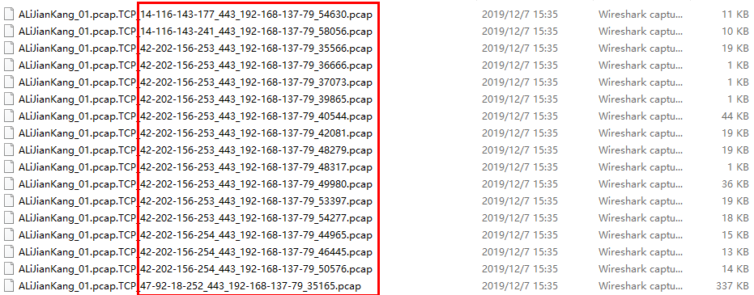

记录计算机网络原理，流量分析相关。

<!--more-->

## 使用tshark过滤HTTPS流量

```POWERSHELL
foreach($f in gci pcaps *pcap)
{
	tshark -r $f.FullName -Y "tcp.port==443" -F pcap -w filtered_pcap\$($f.BaseName).pcap
	echo finised:($f.BaseName)
}
```

- -r：表示加载本地文件
- -Y：表示过滤条件，这里过滤条件是443端口
- -F：表示存储的格式，这里指定pcap，如果指定为pcapng则SplitCap不能加载
- -w：表示存储文件

## 使用SplitCap切分流

```powershell
foreach($f in gci 1_Pcap *.pcap)
{
    SplitCap -p 100000 -b 100000 -r $f.FullName -o 2_Session\AllLayers\$($f.BaseName)-ALL
    SplitCap -p 100000 -b 100000 -r $f.FullName -s flow -o 2_Session\AllLayers\$($f.BaseName)-ALL
    
    gci 2_Session\AllLayers\$($f.BaseName)-ALL | ?{$_.Length -eq 0} | del

    SplitCap -p 100000 -b 100000 -r $f.FullName -o 2_Session\L7\$($f.BaseName)-L7 -y L7
    SplitCap -p 100000 -b 100000 -r $f.FullName -s flow -o 2_Session\L7\$($f.BaseName)-L7 -y L7

    gci 2_Session\L7\$($f.BaseName)-L7 | ?{$_.Length -eq 0} | del
}

finddupe -del 2_Session\AllLayers
finddupe -del 2_Session\L7
```

- 等待被处理的文件


- 处理之后的文件




## nslookup批量处理域名

```sh
#!/usr/bin/env bash
echo "############# Reverse DNS ##############"
while read id servername;do
    ip=$(nslookup $servername | grep ^Name -A1 | grep Address | awk '{printf ($2" ")}');
    echo "$id,$servername,$ip";
done<$1 >$2
```

以上，$1是第一个参数，就是要打开的域名文件，$2是跟在命令后的第二个参数，是需要保存结果的文件。^Name -A1表示:找到以Name开头的行，-A1表示显示下一行，grep的具体使用如下：

```
使用方式：grep [OPTIONS] PATTERN [FILE...]
grep [OPTIONS] [-e PATTERN | -f FILE] [FILE...]
常用选项：
　--color=auto：对匹配到的文本着色后进行高亮显示；
　-i：忽略字符的大小写
　-o：仅显示匹配到的字符串
　-v：显示不能被模式匹配到的行
　-E：支持使用扩展的正则表达式
　-q：静默模式，即不输出任何信息
　-A #：显示被模式匹配的行及其后#行
　-B #：显示被模式匹配的行及其前#行
　-C #：显示被模式匹配的行及其前后各#行
```

## 包分析(packet to flow)

### 工具安装

```sh
# ==========软件依赖=============
yum install libtool
yum install bzip2-devel
yum install flex
yum install byacc
yum install libpcap-devel
# =============end===============
# ===========软件安装=============
# 安装nfdump
(1)下载：https://github.com/phaag/nfdump
(2)安装：
chmod +x autogen.sh
./ autogen.sh
./configure
make
make install
# 安装nfcapd
(1)下载： https://github.com/YasuhiroABE/ansible-nfcapd
(2)安装：make install
# 安装Softflowd
(1)下载：https://storage.googleapis.com/google-code-archive-downloads/v2/code.google.com/softflowd/softflowd-0.9.9.tar.gz
(2)安装：
./configure 
make 
make install
# ==============end==============
# ===========使用方法=============
# 步骤(1)
nfcapd -b localhost -p 12056 -l /home/train-week1-1/tmp
# 步骤(2)
softflowd -r /home/ train-week1-1/ train-week1-1.cap -n localhost:12056 -v 5
# 步骤(3)
nfdump -r nfcapd.201809120412 -o "fmt:%ts %te %sa %da %sp %dp %pr %flg %pkt %byt %tos" >train-week1-1-result.txt
```

### pcap按照TCP flow切分(Scapy+Python)

主要功能与Windows下的SplitCap类似，使用Python2.7基于Scapy编写的脚本，代码如下：

```python
#!/usr/bin/env python
#encoding=utf-8
"""
@author: TianMao
@contact: tianmao1994@yahoo.com
@file: split-pcap.py
@time: 19-11-27 下午6:38
@desc:
    功能：按照TCP流切分pcap文件
    参考：https://github.com/mao-tool/packet-analysis
    环境：Scapy
    使用：python split-pcap.py test.pcap
    输出：test.pcap_220.194.64.35-443_192.168.137.22-56458_split.pcap
    问题：当前输出为splitcap文件的一般？疑似这里处理的是双向流？
"""

import sys
import re
import glob

# This is needed to suppress a really irrating warning message when scapy
# is imported
import logging
logging.getLogger("scapy.runtime").setLevel(logging.ERROR)


try:
    from scapy.all import*
except ImportError:
    print "scapy is not installed. See comments for installation suggestions"
    exit ()

# argument processing, require just the file name. If a second argument
# is provided make sure its an integer
if len (sys.argv) < 2 or len (sys.argv) > 3:
   print "Usage is: split-pcap.py file-name [packet-count]"
   print "Try\n     grep -A 20 Usage: " + sys.argv[0] +  \
                                            " | head -20\nfor details"
   exit ()

if len (sys.argv) == 3:
   inputFileString = sys.argv [1]
   try:
      inputTotalPackets = int (sys.argv [2])
   except ValueError:
      print "The second argument must be an integer <" + \
                       sys.argv [2] + "> does appear to be an integer"
      exit ()
else:
   inputFileString = sys.argv [1]
   inputTotalPackets = 0


# 保存文件夹
out_dir = "../../../../data/1/raw_2/"

# try opening the file.
try:
   pcapIn = PcapReader (inputFileString)
except IOError:
   print "It doesn't look like " + inputFileString + " exists"
   exit()
except NameError:
   print "It doesn't look like " + inputFileString + \
                                      " is a file that can be processed."
   print "Note that this script cannot process pcapng files. Review the "
   print "usage details for ideas on how to convert from pcapng to pcap"
   exit ()

# Extract out just the the file name. Note that I assume the the ".*/" match
# is greedy and will match until the last "/" character in the string. If
# the match fails there are no "/" characters so the whole string must be the
# name.
x = re.search ("^.*/(.*$)", inputFileString)
try:
   prefix = x.group(1) + "_"
except:
   prefix = inputFileString + "_"

# Look for prefix*_split.pcap files. If you find them print a
# warning and exit.

t = len (glob (prefix + "*_split.pcap"))
if t > 0:
   print "There are already " + str (t) + " files with the name " + \
       prefix + "*_split.pcap."
   print "Delete or rename them or change to a different directory to"
   print "avoid adding duplicate packets into the " + prefix + \
                                               "*_split.pcap trace files."
   exit ()

# 判断是否存在当前文件的文件夹
if not os.path.exists(out_dir + inputFileString):
    os.makedirs(out_dir + inputFileString)


pcapOutName = ""
oldPcapOutName = ""
packetCount = 0
donePercentage = 0;
oldDonePercentage = -1

# Loop for each packet in the file

for aPkt in pcapIn:

# count the packets read
   packetCount = packetCount + 1

# If the packet contains a TCP header extract out the IP addresses and
# port numbers
   if TCP in aPkt:
      ipSrc = aPkt[IP].src
      tcpSport = aPkt[TCP].sport
      ipDst = aPkt[IP].dst
      tcpDport = aPkt[TCP].dport

# put things in some sort of cannonical order. It doesn't really matter
# what the order is as long as packets going in either direction get the
# same order.
      if ipSrc > ipDst:
         pcapOutName = prefix + ipSrc + "-" + str(tcpSport) + "_" + ipDst + "-" + str(tcpDport) + "_split.pcap"
      elif ipSrc < ipDst:
         pcapOutName = prefix + ipDst + "-" + str(tcpDport) + "_" + ipSrc + "-" + str(tcpSport) + "_split.pcap"
      elif tcpSport > tcpDport:
         pcapOutName = prefix + ipSrc + "-" + str(tcpSport) + "_" + ipDst + "-" + str(tcpDport) + "_split.pcap"
      else:
         pcapOutName = prefix + ipDst + "-" + str(tcpDport) + "_" + ipSrc + "-" + str(tcpSport) + "_split.pcap"

# If the current packet should be written to a different file from the last
# packet, close the current output file and open the new file for append
# save the name of the newly opened file so we can compare it for the next
# packet.
      if pcapOutName != oldPcapOutName:
         if oldPcapOutName != "":
            pcapOut.close()

         if type(aPkt) == scapy.layers.l2.Ether:
            lkType = 1
         elif type (aPkt) == scapy.layers.l2.CookedLinux:
            lkType = 113
         else:
            print "Unknown link type: "
            type (aPkt)
            print "    -- exiting"
            exit

         # 修改文件路劲
         pcapOutName = out_dir+inputFileString+"/"+pcapOutName
         pcapOut = PcapWriter (pcapOutName, linktype=lkType, append=True)
         oldPcapOutName = pcapOutName

# write the packet
      pcapOut.write (aPkt)

# Write the progress information, either percentages if we had a packet-count
# argument or just the packet count.

      if inputTotalPackets > 0:
         donePercentage = packetCount * 100 / inputTotalPackets
         if donePercentage > oldDonePercentage:
            print "Percenage done: ", donePercentage
            oldDonePercentage = donePercentage
      else:
         print packetCount
```

输出：建一个与当前pcap文件名相同的文件夹，如，当前python split-pcap.py scapy-split-pcap.png保存如下：


