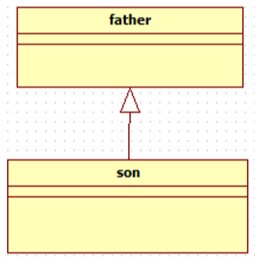
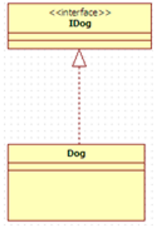
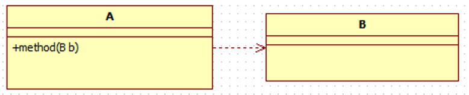
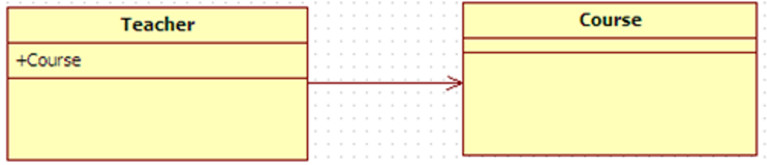
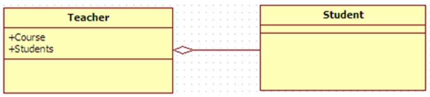
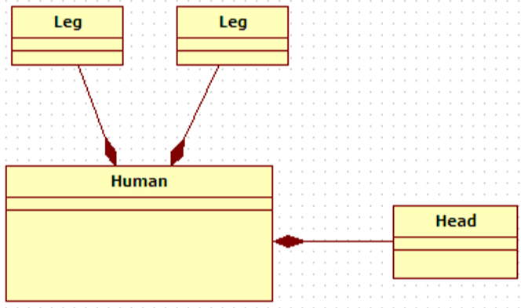

在实际的例子中来学习设计模式。

<!--more-->

# UML

| 名称     | 解释                                                         | 图片                       |
| -------- | ------------------------------------------------------------ | -------------------------- |
| **泛化** | 泛化是一种**一般与特殊**、**一般与具体**之间关系的描述，<br />具体描述建立在一般描述的基础之上，并对其进行了扩展。<br />在java中用来表示继承的关系。 |    |
| **实现** | 实现是一种**类与接口**的关系，<br />表示类是接口所有特征和行为的实现，<br />在程序中一般通过类实现接口来描述 |   |
| **依赖** | 是一种**使用**的关系，即一个类的实现需要另一个类的协助。<br />java中，方法参数需要传入另一个类的对象，就表示依赖这个类。<br />表示方法：虚线箭头，类A指向类B。 |     |
| **关联** | 表示类与类之间的联接,它使一个类知道另一个类的属性和方法，<br />这种关系比依赖更强、不存在依赖关系的偶然性、关系也不是临时性的，一般是长期性的。 |  |
| **聚合** | java中一个类的全局变量引用了另一个类，就表示关联了这个类聚合关联关系的一种特例，是强的关联关系。<br />聚合是整体和个体之间的关系，即has-a的关系，<br />整体与个体可以具有各自的生命周期，部分可以属于多个整体对象，也可以为多个整体对象共享。<br />程序中聚合和关联关系是一致的，只能从语义级别来区分； |      |
| **组合** | 组合也是关联关系的一种特例。组合是一种整体与部分的关系，即contains-a的关系，比聚合更强。<br />部分与整体的生命周期一致，整体的生命周期结束也就意味着部分的生命周期结束，组合关系不能共享。<br />程序中组合和关联关系是一致的，只能从语义级别来区分。 |      |


# 构造者模式

## 思想

不直接产生想要的对象，让客户端在builder对象上调用类似setter的方法，来设置每个相关的可选参数，最后客户端调用无参的build方法来生成通常不可变的对象。

## Demo

```java
package com.mao.rong;

public class BuilderTest {
    private int paramA;
    private int paramB;
    private int paramC;
    private int paramD;
    private int paramE;

    public static class Builder {

        private int paramA;
        private int paramB;

        private int paramC = 0;
        private int paramD = 0;
        private int paramE = 0;

        public Builder(int paramA, int paramB) {
            this.paramA=paramA;
            this.paramB=paramB;
        }

        public Builder paramC(int val){ paramC = val;   return this; }
        public Builder paramD(int val){ paramD = val;   return this; }
        public Builder paramE(int val){ paramE = val;   return this; }
        // build方法没有参数，是静态类的成员方法，调用build方法生成对象
        public BuilderTest build() {
            return new BuilderTest(this);
        }
    }
    // 有参的构造器
    private BuilderTest(Builder builder){
        paramA = builder.paramA;
        paramB = builder.paramB;
        paramC = builder.paramC;
        paramD = builder.paramD;
        paramE = builder.paramE;
    }
}
// 使用
package com.mao.rong;

public class Main {
    public static void main(String[] args) {
        BuilderTest builderTest = new BuilderTest.Builder(1,2)
                .paramC(3)
                .paramD(4)
                .paramE(5)
                .build();
    }
}
```

## 举例

在构建请求参数的时候，可以按照以上的方法设置具名的操作。当然想实现具名的请求参数构建，可以写为以下的方式：

```Java
@Data
public class R {
    @ApiModelProperty(value = "是否成功")
    private Boolean success;

    @ApiModelProperty(value = "返回码")
    private Integer code;

    @ApiModelProperty(value = "返回消息")
    private String message;

    @ApiModelProperty(value = "返回数据")
    private Map<String, Object> data = new HashMap<String, Object>();

    private R(){}

    public static R ok(){
        R r = new R();
        r.setSuccess(true);
        r.setCode(ResultCode.SUCCESS);
        r.setMessage("成功");
        return r;
    }

    public static R error(){
        R r = new R();
        r.setSuccess(false);
        r.setCode(ResultCode.ERROR);
        r.setMessage("失败");
        return r;
    }

    public R success(Boolean success){
        this.setSuccess(success);
        return this;
    }

    public R message(String message){
        this.setMessage(message);
        return this;
    }

    public R code(Integer code){
        this.setCode(code);
        return this;
    }

    public R data(String key, Object value){
        this.data.put(key, value);
        return this;
    }

    public R data(Map<String, Object> map){
        this.setData(map);
        return this;
    }
}
```


