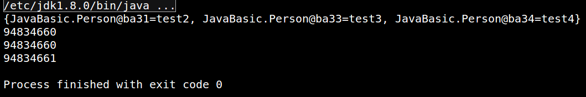
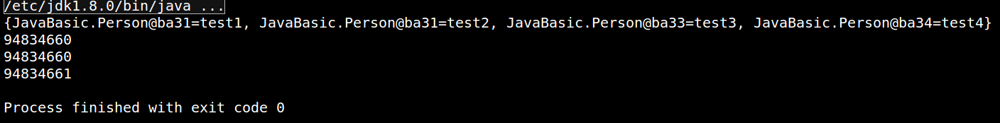

## 1.What?

- 如果两个对象相等，则hashcode一定也是相同的
- 两个对象相等，对两个对象分别调用equals方法都返回true
- 两个对象有相同的hashcode值，它们也不一定是相等的
- 因此，equals方法被覆盖过，则hashCode方法也必须被覆盖
- hashCode()的默认行为是对堆上的对象产生独特值。如果没有重写hashCode()，则该class的两个对象无论如何都不会相等（即使这两个对象指向相同的数据）

<!--more-->

## 2.Why?

举两个场景就很明确知道为何要重写了?

- Set中存自定义的对象
- Map中使用自定义对象作为key

以上,如果不重写,即使我们对象的属性值完全相等(就是从意义上完全相等),但是我们new出来的对象是两个不同的对象,那么在加入Set或者作为Map的键时候是会作为unique的,那么添加后,我们会发现意义上一样的值同时存在于Set中,更加不幸的是,我们新建一个对象作为Key去Map中取值会永远也取不到!!!

```java
package JavaBasic;

import java.util.HashMap;
/**
 * @Classname OverideEqualsHashcode
 * @Description 重写equals和hashCode方法
 * @Date 19-7-5 下午4:04
 * @Created by mao<tianmao818@qq.com>
 */

class Person{
    private String id;
    public Person(String id){
        this.id=id;
    }
    @Override
    public boolean equals(Object o){

        if(this==o){
            return true;
        }
        if(o==null||getClass()!=o.getClass()){
            return false;
        }
        Person person=(Person)o;

        if(id!=null?(!id.equals(person.id)):(person.id!=null)){
            return false;
        }
        return true;
    }
    @Override
    public int hashCode(){
        return id!=null?id.hashCode():0;
    }
}
public class OverideEqualsHashcode {
    public static void main(String[] args){
        HashMap<Person,String> map=new HashMap<>();
        // 如果不重写,将会有四个对象加入,即使对象的信息相同,但是euqals的是对象的地址,新建一个对象地址肯定不一样
        map.put(new Person("001"),"test1");
        map.put(new Person("001"),"test2");
        map.put(new Person("003"),"test3");
        map.put(new Person("004"),"test4");
        System.out.println(map.toString());

        // 如果只重写hashCode,hashCode即使一样,对象还是不一样
        System.out.println((new Person("code1")).hashCode());
        System.out.println((new Person("code1")).hashCode());
        System.out.println((new Person("code2")).hashCode());
    }
}
```

- 重写equals函数和hashCode函数,执行的结果和预期相同



- 只重写了hashCode,发现hashCode虽然可能一样,但是并不能够正确判断对象就是相等的,这也是为什么必须重写equals



- 均不重写,hashCode不同(当然不能保证完全不同,毕竟有碰撞的存在),对象完全不相等!


## 3.How?

重写hashCode:重新计算hash值;重写equals:重写方法:保证对象的每一个属性都有覆盖到,做到完全相等!

- 经典方法
- 借助Objects类
- 借助Apache.commons.lang3

```java
import org.apache.commons.lang3.builder.EqualsBuilder;
import org.apache.commons.lang3.builder.HashCodeBuilder;
import java.util.Objects;
class User {
    private String name;
    private int age;
    private String passport;

    //getters and setters, constructor

    @Override
    public boolean equals(Object o) {

        if (o == this) return true;
        if (!(o instanceof User)) {
            return false;
        }

        User user = (User) o;

        return user.name.equals(name) &&
                user.age == age &&
                user.passport.equals(passport);
    }

    //Idea from effective Java : Item 9
    @Override
    public int hashCode() {
        int result = 17;
        result = 31 * result + name.hashCode();
        result = 31 * result + age;
        result = 31 * result + passport.hashCode();
        return result;
    }

}

class User_1 {
    private String name;
    private int age;
    private String passport;

    //getters and setters, constructor
    @Override
    public boolean equals(Object o) {

        if (o == this) return true;
        if (!(o instanceof User)) {
            return false;
        }
        User_1 user = (User_1) o;
        return age == user.age &&
                Objects.equals(name, user.name) &&
                Objects.equals(passport, user.passport);
    }

    @Override
    public int hashCode() {
        return Objects.hash(name, age, passport);
    }

}

class User_2 {
    private String name;
    private int age;
    private String passport;

    //getters and setters, constructor
    @Override
    public boolean equals(Object o) {

        if (o == this) return true;
        if (!(o instanceof User_2)) {
            return false;
        }

        User_2 user = (User_2) o;

        return new EqualsBuilder()
                .append(age, user.age)
                .append(name, user.name)
                .append(passport, user.passport)
                .isEquals();
    }

    @Override
    public int hashCode() {
        return new HashCodeBuilder(17, 37)
                .append(name)
                .append(age)
                .append(passport)
                .toHashCode();
    }

}
```

